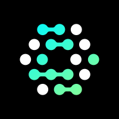

<div align="center">


# OpenFGA

[](https://openfga.dev/community)
[![DeepWiki](https://img.shields.io/badge/DeepWiki-openfga%2Fopenfga-blue.svg?logo=data:image/png;base64,iVBORw0KGgoAAAANSUhEUgAAACwAAAAyCAYAAAAnWDnqAAAAAXNSR0IArs4c6QAAA05JREFUaEPtmUtyEzEQhtWTQyQLHNak2AB7ZnyXZMEjXMGeK/AIi+QuHrMnbChYY7MIh8g01fJoopFb0uhhEqqcbWTp06/uv1saEDv4O3n3dV60RfP947Mm9/SQc0ICFQgzfc4CYZoTPAswgSJCCUJUnAAoRHOAUOcATwbmVLWdGoH//PB8mnKqScAhsD0kYP3j/Yt5LPQe2KvcXmGvRHcDnpxfL2zOYJ1mFwrryWTz0advv1Ut4CJgf5uhDuDj5eUcAUoahrdY/56ebRWeraTjMt/00Sh3UDtjgHtQNHwcRGOC98BJEAEymycmYcWwOprTgcB6VZ5JK5TAJ+fXGLBm3FDAmn6oPPjR4rKCAoJCal2eAiQp2x0vxTPB3ALO2CRkwmDy5WohzBDwSEFKRwPbknEggCPB/imwrycgxX2NzoMCHhPkDwqYMr9tRcP5qNrMZHkVnOjRMWwLCcr8ohBVb1OMjxLwGCvjTikrsBOiA6fNyCrm8V1rP93iVPpwaE+gO0SsWmPiXB+jikdf6SizrT5qKasx5j8ABbHpFTx+vFXp9EnYQmLx02h1QTTrl6eDqxLnGjporxl3NL3agEvXdT0WmEost648sQOYAeJS9Q7bfUVoMGnjo4AZdUMQku50McDcMWcBPvr0SzbTAFDfvJqwLzgxwATnCgnp4wDl6Aa+Ax283gghmj+vj7feE2KBBRMW3FzOpLOADl0Isb5587h/U4gGvkt5v60Z1VLG8BhYjbzRwyQZemwAd6cCR5/XFWLYZRIMpX39AR0tjaGGiGzLVyhse5C9RKC6ai42ppWPKiBagOvaYk8lO7DajerabOZP46Lby5wKjw1HCRx7p9sVMOWGzb/vA1hwiWc6jm3MvQDTogQkiqIhJV0nBQBTU+3okKCFDy9WwferkHjtxib7t3xIUQtHxnIwtx4mpg26/HfwVNVDb4oI9RHmx5WGelRVlrtiw43zboCLaxv46AZeB3IlTkwouebTr1y2NjSpHz68WNFjHvupy3q8TFn3Hos2IAk4Ju5dCo8B3wP7VPr/FGaKiG+T+v+TQqIrOqMTL1VdWV1DdmcbO8KXBz6esmYWYKPwDL5b5FA1a0hwapHiom0r/cKaoqr+27/XcrS5UwSMbQAAAABJRU5ErkJggg==)](https://deepwiki.com/openfga/openfga)
[](https://pkg.go.dev/github.com/openfga/openfga)

[](https://hub.docker.com/r/openfga/openfga/tags)
[](https://app.codecov.io/gh/openfga/openfga)
[](https://goreportcard.com/report/github.com/openfga/openfga)
[](https://bestpractices.coreinfrastructure.org/projects/6374)
[](https://app.fossa.com/projects/git%2Bgithub.com%2Fopenfga%2Fopenfga?ref=badge_shield)
[](https://artifacthub.io/packages/helm/openfga/openfga)
[](https://securityscorecards.dev/viewer/?uri=github.com/openfga/openfga)
[](https://slsa.dev)

</div>

---

**OpenFGA** is a high-performance, flexible authorization/permission engine inspired by [Google Zanzibar](https://research.google/pubs/pub48190/).
It helps developers easily model and enforce fine-grained access control in their applications.

## Highlights

- ⚡ High-performance, developer-friendly APIs (HTTP & gRPC)
- 🔌 Flexible storage backends (In-Memory, PostgreSQL, MySQL, SQLite beta)
- 🧰 SDKs for [Java](https://central.sonatype.com/artifact/dev.openfga/openfga-sdk), [Node.js](https://www.npmjs.com/package/@openfga/sdk), [Go](https://github.com/openfga/go-sdk), [Python](https://github.com/openfga/python-sdk), [.NET](https://www.nuget.org/packages/OpenFga.Sdk)
- 🌐  Several additional SDKs and tools [contributed by the community](https://github.com/openfga/community#community-projects)
- 🧪 [CLI](https://github.com/openfga/cli) for interacting with an OpenFGA server and [testing authorization models](https://openfga.dev/docs/modeling/testing)
- 🌿 [Terraform Provider](https://github.com/openfga/terraform-provider-openfga) for configuring OpenFGA servers as code
- 🎮 [Playground](https://openfga.dev/docs/getting-started/setup-openfga/playground) for modeling and testing
- 🛠 Can also be embedded as a [Go library](https://pkg.go.dev/github.com/openfga/openfga/pkg/server#example-NewServerWithOpts)
- 🤝 Adopted by [Auth0](https://fga.dev), [Grafana Labs](https://grafana.com/), [Canonical](https://canonical.com/), [Docker](https://docker.com),  [Agicap](https://agicap.com), [Read.AI](https://read.ai) and [others](https://github.com/openfga/community/blob/main/ADOPTERS.md)

---

## Table of Contents
- [Quickstart](#quickstart)
- [Installation](#installation)
    - [Docker](#docker)
    - [Docker Compose](#docker-compose)
    - [Homebrew](#homebrew)
    - [Precompiled Binaries](#precompiled-binaries)
    - [Build from Source](#build-from-source)
    - [Verify Installation](#verify-installation)
- [Playground](#playground)
- [Next Steps](#next-steps)
- [Limitations](#limitations)
- [Production Readiness](#production-readiness)
- [Contributing & Community](#contributing--community)

---

## Quickstart

> [!IMPORTANT]  
> The following steps are meant for quick local setup and evaluation.  
> When using the default **in-memory storage engine**, data is ephemeral and will be discarded once the service stops.
>
> For [details on configuring](https://openfga.dev/docs/getting-started/setup-openfga/configure-openfga) storage 
> backends, tuning performance, and deploying OpenFGA securely in production-ready environments, refer to the 
> documentation: [Running in Production](https://openfga.dev/docs/getting-started/running-in-production).


Run OpenFGA with in-memory storage (⚠️ **not for production**):

```shell
docker run -p 8080:8080 -p 3000:3000 openfga/openfga run
```

Once running, create a store:

```shell
curl -X POST 'localhost:8080/stores' \
  --header 'Content-Type: application/json' \
  --data-raw '{"name": "openfga-demo"}'
```

## Installation

### Docker

OpenFGA is available on [Docker Hub](https://hub.docker.com/r/openfga/openfga), so you can quickly start it using the
in-memory datastore by running the following commands:

```shell
docker pull openfga/openfga
docker run -p 8080:8080 -p 3000:3000 openfga/openfga run
```

> [!NOTE]
> When the HTTP server is enabled, it will attempt to establish an internal client connection to the gRPC server via unix domain socket.
> When it is not possible to establish a UDS, the client connection automatically falls back to using a TCP socket.
>
> If running the Docker image using the `--read-only` option, the `--tmpfs` option must also be set in order to enabled use of the unix domain socket.
> For example `--tmpfs /tmp`

### Docker Compose

[`docker-compose.yaml`](./docker-compose.yaml) provides an example of how to launch OpenFGA with Postgres using `docker compose`.

```shell
curl -LO https://openfga.dev/docker-compose.yaml
docker compose up
```

### Homebrew

If you are a [Homebrew](https://brew.sh/) user, you can install [OpenFGA](https://formulae.brew.sh/formula/openfga) with the following command:

```shell
brew install openfga
```

### Precompiled Binaries

Download your platform's [latest release](https://github.com/openfga/openfga/releases/latest) and extract it.
Then run the binary with the command:

```shell
./openfga run
```

### Build from Source

> [!NOTE]  
> Make sure you have the latest version of Go installed. See the [Go downloads](https://go.dev/dl/) page.

#### `go install`

```shell
export PATH=$PATH:$(go env GOBIN) # make sure $GOBIN is on your $PATH
go install github.com/openfga/openfga/cmd/openfga
openfga run
```

#### `go build`

```shell
git clone https://github.com/openfga/openfga.git && cd openfga
go build -o ./openfga ./cmd/openfga
./openfga run
```

### Verify Installation

Now that you have [installed](#installation) OpenFGA, you can test your installation by [creating an OpenFGA Store](https://openfga.dev/docs/getting-started/create-store).

```shell
curl -X POST 'localhost:8080/stores' \
  --header 'Content-Type: application/json' \
  --data-raw '{"name": "openfga-demo"}'
```

If everything is running correctly, you should get a response with information about the newly created store, for example:

```json
{
  "id": "01G3EMTKQRKJ93PFVDA1SJHWD2",
  "name": "openfga-demo",
  "created_at": "2022-05-19T17:11:12.888680Z",
  "updated_at": "2022-05-19T17:11:12.888680Z"
}
```

## Playground

The Playground lets you model, visualize, and test authorization setups.
By default, it’s available at: [http://localhost:3000/playground](http://localhost:3000/playground)

> [!NOTE]  
> The Playground is intended for **local development only**.  
> It can currently only be configured to connect to an OpenFGA server running on `localhost`.

Disable it with:

```shell
./openfga run --playground-enabled=false
```

Change port:

```shell
./openfga run --playground-enabled --playground-port 3001
```

> [!TIP]
> The `OPENFGA_HTTP_ADDR` environment variable can be used to configure the address at which the Playground expects the OpenFGA server to be.
>
> For example:
>
> ```shell
> docker run -e OPENFGA_PLAYGROUND_ENABLED=true \
> -e OPENFGA_HTTP_ADDR=0.0.0.0:4000 \
> -p 4000:4000 -p 3000:3000 openfga/openfga run
> ```
>
> This starts OpenFGA on port 4000 and configures the Playground accordingly.

## Next Steps

Take a look at examples of how to:

- [Write an Authorization Model](https://openfga.dev/api/service#/Authorization%20Models/WriteAuthorizationModel)
- [Write Relationship Tuples](https://openfga.dev/api/service#/Relationship%20Tuples/Write)
- [Perform Authorization Checks](https://openfga.dev/api/service#/Relationship%20Queries/Check)
- [Add Authentication to your OpenFGA server](https://openfga.dev/docs/getting-started/setup-openfga/docker#configuring-authentication)

📚 Explore the [Documentation](https://openfga.dev/) and [API Reference](https://openfga.dev/api/service).

## Limitations

### MySQL Storage engine

The MySQL storage engine has stricter length limits on tuple properties than other backends. See [docs](https://openfga.dev/docs/getting-started/setup-openfga/docker#configuring-data-storage).

💡 OpenFGA’s MySQL adapter was contributed by @twintag — thank you!

## Production Readiness

- ✅ Used in production by [Auth0 FGA](https://auth0.com/fine-grained-authorization) since December 2021
- ⚠️ Memory storage adapter is **for development only**
- 🗄 Supported storage: PostgreSQL 14+, MySQL 8, SQLite (beta)
- 📘 See [Running in Production](https://openfga.dev/docs/best-practices/running-in-production)

The OpenFGA team treats **production-impacting issues with highest priority**.

See organizations using OpenFGA in production: [ADOPTERS.md](https://github.com/openfga/community/blob/main/ADOPTERS.md).
If your organization is using OpenFGA, please consider adding it to the list.

## Contributing & Community

We welcome contributions and community participation.

- 🤝 See [CONTRIBUTING](https://github.com/openfga/.github/blob/main/CONTRIBUTING.md)
- 🗓 [Monthly Community Meetings](https://github.com/openfga/community/blob/main/community-meetings.md)
- 💬 Join us on [Slack](https://openfga.dev/docs/community)
