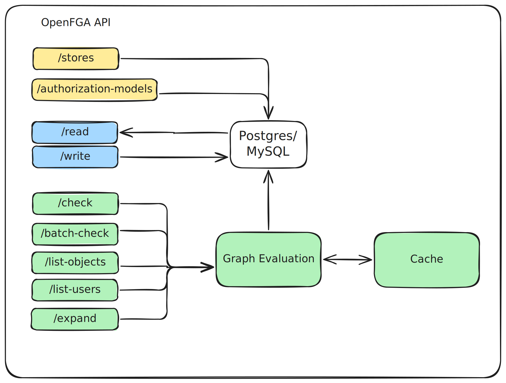

# OpenFGA High Level Architecture

OpenFGA is a server that reads/writes from a database, and its architecture is similar to any other system that does that:

- The client application is a service that calls OpenFGA. It can call it using the gRPC API or the HTTP API directly, or through OpenFGA's SDKs (JS, Python, Go, Java, .NET). 

- Calls to the OpenFGA API can be authenticated using a shared secret or through a client credentials flow. If the application uses client credentials, it needs to obtain those for an OAuth client credentials provider (KeyCloak, Auth0, Microsoft Entra etc). 

- The cluster needs to have an ingress for load balancing and eventually service authentication (e.g. nginx).

- The OpenFGA service needs a database. At the time of writing this the supported one were Postgres, MySQL and SQLite. SQLite is not designed for deployment in a Kubernetes cluster.
- OpenFGA supports OTEL metrics, OTEL traces and JSON logging. These can be sent to any collector.

## Internal Architecture

The following diagram describes at high level how OpenFGA works internally. 

- The [`/store`](https://openfga.dev/api/service#/Stores/CreateStore) endpoints allow managing OpenFGA stores, which contain the authorization model + the data. Stores can be used for isolate different applications, environments, or tenants.

- The [`/authorization-models`](https://openfga.dev/api/service#/Authorization%20Models/WriteAuthorizationModel) endpoints allow writing new authorization models, which define the authorizatoin policies.

 [`/write`](https://openfga.dev/api/service#/Relationship%20Tuples/Write) endppints read and write relationship tuples, which are validated and stored in the configured database.

- The [`/read`](https://openfga.dev/api/service#/Relationship%20Tuples/Read) and [`/write`](https://openfga.dev/api/service#/Relationship%20Tuples/Write) endppints read and write relationship tuples, which are validated and stored in the configured database.

- The [`/check`](https://openfga.dev/api/service#/Relationship%20Queries/Check), [`/batch-check`](https://openfga.dev/api/service#/Relationship%20Queries/BatchCheck), [`/list-objects`](https://openfga.dev/api/service#/Relationship%20Queries/ListObjects), [`/list-users`](https://openfga.dev/api/service#/Relationship%20Queries/ListUsers), [`/expand`](https://openfga.dev/api/service#/Relationship%20Queries/Expand) endpoints evaluate the permission graph, reading data the database and two caches.

The `check cache` stores the results of subproblems that were evaluated while resolving a `check` call.

The `iterator cache` stores results from queries like "retrieve all members of a specific group".

For more information about how OpenFGA evaluates the permission graph, refer to the following documents:

- [Check implementation](../check/README.md)
- [ListObjects implementation](../check/README.md)
- [ListObjects with intersection or exclusion implementation ](../list_objects/example_with_intersection_or_exclusion/example.md)
