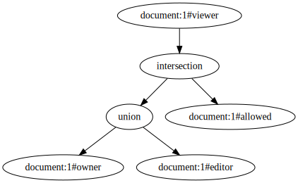
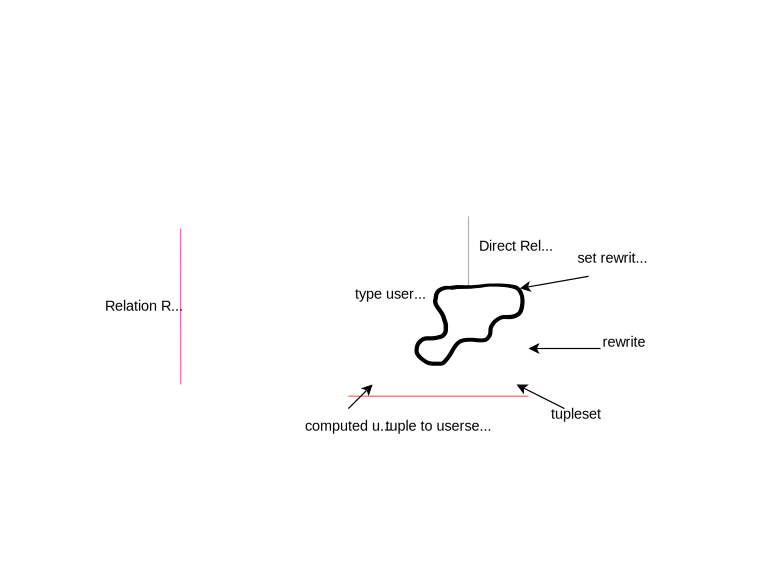

# Check Implementation<!-- omit in toc -->

- [Overview](#overview)
- [Definitions](#definitions)
- [Direct Rewrites](#direct-rewrites)
  - [Direct Relationships](#direct-relationships)
  - [Computed Relationships (e.g. computed\_userset)](#computed-relationships-eg-computed_userset)
  - [Hierarchical Relationships (e.g. tuple\_to\_userset or TTU)](#hierarchical-relationships-eg-tuple_to_userset-or-ttu)
    - [TTU Rewrite Constraints](#ttu-rewrite-constraints)
      - [Example 1 (invalid)](#example-1-invalid)
      - [Example 2 (invalid)](#example-2-invalid)
      - [Example 3 (valid)](#example-3-valid)
- [Set Rewrites](#set-rewrites)
  - [Union](#union)
    - [Example 1](#example-1)
    - [Example 2](#example-2)
    - [Example 3](#example-3)
  - [Intersection](#intersection)
    - [Example 1](#example-1-1)
    - [Example 2](#example-2-1)
  - [Exclusion (Difference)](#exclusion-difference)
    - [Example 1](#example-1-2)
    - [Example 2](#example-2-2)
    - [Example 3](#example-3-1)
- [Advanced Behavior](#advanced-behavior)
  - [Cycle Detection](#cycle-detection)
  - [Concurrency Control](#concurrency-control)
    - [Resolution Depth](#resolution-depth)
    - [Resolution Breadth](#resolution-breadth)
    - [Bounding Concurrency at the Storage Layer](#bounding-concurrency-at-the-storage-layer)
  - [CheckResolver](#checkresolver)
  - [Delegate Composition (Delegation)](#delegate-composition-delegation)
- [Code References](#code-references)


## Overview
The [Check API](https://openfga.dev/api/service#/Relationship%20Queries/Check) looks up if a particular user/subject has specific relationship with a given object.

It can be viewed as a traversal on a directed, possibly cyclical, graph. For a large number of scenarios, the relationship graph is just a tree. It starts at a given `object#relation` expands relationships until a particular user/subject is found, or until all paths of the graph have been visited and no such user was found. As a simple example, consider the following relationship tree:



In this relationship tree we say that anyone is a viewer of `document:1` if they are either (e.g. union) an owner of that document or an editor of it AND (intersection) they are allowed on the document.

As relationships are expanded the Check algorithm follows relationship rewrite rules, and these rewrite rules define one or more paths that must be evaluated. For example, given the following FGA model:
```
model
  schema 1.1

type user

type folder
 relations
   define viewer: [user]

type document
  relations
    define parent: [folder]
    define editor: [user] or editor from parent
    define viewer: editor
```
The `document#viewer` relation is "rewritten" indirectly as `document#editor`, which means that in order to evaluate a specific relationship of the form `Check(document:1#viewer@user:jon)` we must actually rewrite that lookup as `Check(document:1#editor@user:jon)`. Similarly, the `document#editor` relationship is rewritten using a set union (e.g. `or` keyword) such that if a user is either directly an editor of the document or an editor on the parent folder, then the user can edit the document. This kind of rewritten behavior allows us to model hierarchical semantics. These "rewrites" make up the base-line behavior behind the semantics of the FGA graph traversal, and we explain each of them with examples in further detail below.

## Definitions
Familiarity with basic [OpenFGA Concepts](https://openfga.dev/docs/concepts) is expected, but the following are some terms used throughout this document that are more specific to the content herein:

* **Relation Rewrite (Rewrite)** - a rule that expresses an FGA relationship as a composition of other relationships. For example, you can "rewrite" a viewer relationship as editor or express a hierarchy between two objects. These rules can also be composed using set operations including union, intersection, and exclusion.



* **Rewrite Operand** - for rewrites involving set operations (e.g. union, intersection, exclusion) a rewrite operand refers to the relation rewrites that are evaluated as part of the set expression. For example, the rewrite operands of the definition `a or b` are `a` and `b`.

* **Subproblem** - an FGA query that is contingent on one or more evaluations of nested relationship evaluations (including itself). An FGA query may involve duplicate subproblems. In other words, some parent subproblem may involved more than one identical descendant subproblem.

* **Dispatch** - refers to the process of evaluating a single nested subproblem (or indirect subgraph) in order to resolve some parent subproblem. A single dispatch may lead to 0 or more subsequent dispatches, which can be viewed as further expanding subgraphs stemming from a single parent relationship. Dispatches occur as a result of a change of object or relation, which largely occurs due to usersets in FGA and/or rewrite rules.

* **Expansion** - refers more generally to the <u>process</u> of an iterative evaluation of one or more subproblems in order to determine some FGA query outcome. An expansion of an FGA relationship requires a minimum of 1 lookup followed by 0 or more subsequent dispatches to resolve residual usersets. Expansion is not to be confused with dispatch, because expansion involves potentially 0 or more dispatches whereas dispatch itself refers specifically to a evaluation of a singular subgraph. The term "expansion" is more generally used when referring to the evaluation of a whole relationship graph/tree whereas "dispatch" is a term more generally used to refer to the evaluation of a single branch of a larger relationship graph/tree. Expansion of an FGA relationships involves potentially many dispatches of related (indirect) subproblems.

## Direct Rewrites
Direct rewrites establish the most basic form of FGA relationship rewrite definitions. These direct rewrites allow developers to express the most basic of authorization model semantics, including direct permissions, indirect or computed permissions, and/or hierarchical permissions.

> ℹ️ The term "permission" is used above, but from here forward we will formally refer to permissions simply as relationships. A users/subject has a permission if they have the relationship, and a relationship can be realized through one or more relationship rewrites.

### Direct Relationships
> e.g. define viewer: [user]
> e.g. define viewer: [group#member]

If a relation can be directly assigned or given/shared with a specific user/subject, then we refer to it as a "direct relationship". Direct relationships are any of those relationships that, for a particular authorization model, can be written to an [FGA Store](https://openfga.dev/docs/concepts#what-is-a-store) using the [Write API](https://openfga.dev/api/service#/Relationship%20Tuples/Write). Looking at the model below, the `document#owner` relationship is a direct relationship, because `user` objects can be directly written/assigned to document owners. This is evident by the defined `[user]` type restriction on the owner relation. Similarly, the `document#viewer` relationship is a direct relationship, because any set of users/subjects of the form `group#member` can be directly written/assigned to document viewer.

```
model
  schema 1.1

type user

type group
  relations
    define member: [user, group#member]

type document
  relations
    define owner: [user]
    define viewer: [group#member]
```

Evaluation of direct relationships involves a direct database lookup. If the user/subject is a set of subjects, then further expansion must occur. For example, consider the following tuples:

| object     | relation | user             |
|------------|----------|------------------|
| document:1 | owner    | user:jon         |
| document:1 | viewer   | group:fga#member |
| group:fga  | member   | user:andres      |

Evaluation of the query `Check(document:1#owner@user:jon)` would involve a direct lookup involving the following callstack:

```
Server#Check(document:1#owner@user:jon)
|--> LocalChecker#ResolveCheck(document:1#owner@user:jon)
|-----> LocalChecker#checkDirect(document:1#owner@user:jon)
|--------> storage#ReadUserTuple(document:1#owner@user:jon) --> ["document:1#owner@user:jon"]
|--------> return {allowed: true} // found a direct resolution path
```

Evaluation of the query `Check(document:1#owner@user:bob)` would involve the following callstack:

```
Server#Check(document:1#owner@user:bob)
|--> LocalChecker#ResolveCheck(document:1#owner@user:bob)
|-----> LocalChecker#checkDirect(document:1#owner@user:bob)
|--------> storage#ReadUserTuple(document:1#owner@user:bob) --> []
|--------> return {allowed: false} // no direct resolution path found
```

Evaluation of `Check(document:1#viewer@user:andres)` would involve a little further expansion, for example:
```
Server#Check(document:1#viewer@user:andres)
|--> LocalChecker#ResolveCheck(document:1#viewer@user:andres)
|-----> LocalChecker#checkDirect(document:1#viewer@user:andres)
|--------> storage#ReadUsersetTuples(document:1#viewer) --> ["document:1#viewer@group:fga#member"]
|--------> LocalChecker#ResolveCheck(group:fga#member@user:andres) <-- dispatch a new Check subproblem
|-----------> LocalChecker#checkDirect(group:fga#member@user:andres)
|--------------> storage#ReadUserTuple(group:fga#member@user:andres) --> ["group:fga#member@user:andres"]
|--------------> return {allowed: true} // found resolution path through group#member relationship
|--------------> storage#ReadUsersetTuples(group:fga#member) --> []
```
In the example immediately above we had to follow an intermediate relationship through `group:fga#member` in order to find `user:andres`. When we have to start evaluation of a new subproblem to determine graph reachability, we refer to this process as "dispatching". Dispatching is when we have to dispatch resolution of a new subproblem in order to evaluate another subproblem.

> ℹ️ We'll use the callstack format above to demonstrate resolution of various Check queries from here forward. These callstacks are defined using the format `package#method` so that you can follow along in the code more easily if you want to learn more by looking at the code.

### Computed Relationships (e.g. computed_userset)
> e.g. define viewer: editor

Evaluation of computed relationships involves an indirect evaluation of the computed relation, and the computed relation may involve one or more other rewritten relationships not just direct relationships. For example, consider the following model and tuples:

```
model
  schema 1.1

type user

type document
  relations
    define owner: [user]
    define editor: [user] or owner
    define viewer: editor
```

| object     | relation | user        |
|------------|----------|-------------|
| document:1 | owner    | user:jon    |
| document:1 | editor   | user:andres |

In this model the `document#viewer` relation is purely rewritten as `document#editor`, which means that a user/subject *must* be an editor to also be a viewer, and the evaluation of the `document#editor` relation involves a union (see [union](#union) below for more info) of either a direct relationship `document#editor` or an owner relationship `document#owner`. That is, if a user/subject is either a direct editor of a document or the owner of it, then they have the editor relationship and therefore the viewer relationship as well.

Evaluation of the query `Check(document:1#viewer@user:jon)` would involve the following callstack:

```
Server#Check(document:1#viewer@user:jon)
|--> LocalChecker#ResolveCheck(document:1#viewer@user:jon)
|-----> LocalChecker#checkComputedUserset(document:1#viewer@user:jon)
|--------> LocalChecker#ResolveCheck(document:1#editor@user:jon) <-- notice the rewritten ResolveCheck
|-----------> LocalChecker#union
|--------------> LocalChecker#checkDirect(document:1#editor@user:jon)
|-----------------> storage#ReadUserTuple(document:1#editor@user:jon) --> []
|--------------> LocalChecker#checkDirect(document:1#owner@user:jon)
|-----------------> storage#ReadUserTuple(document:1#owner@user:jon) --> ["document:1#owner@user:jon"]
|-----------------> return {allowed: true} // found a resolution path  through 'document:1#owner'
```
Notice that since `user:jon` is the owner of the document he is also a viewer indirectly through the computed relationship.

Evaluation of the query `Check(document:1#viewer@user:andres)` would involve the following callstack:

```
Server#Check(document:1#viewer@user:andres)
|--> LocalChecker#ResolveCheck(document:1#viewer@user:andres)
|-----> LocalChecker#checkComputedUserset(document:1#viewer@user:andres)
|--------> LocalChecker#ResolveCheck(document:1#editor@user:andres) <-- notice the rewritten ResolveCheck
|-----------> LocalChecker#union
|--------------> LocalChecker#checkDirect(document:1#editor@user:andres)
|-----------------> storage#ReadUserTuple(document:1#editor@user:andres) --> ["document:1#editor@user:andres"]
|-----------------> return {allowed: true} // found a resolution path  through 'document:1#editor'
|--------------> LocalChecker#checkDirect(document:1#owner@user:andres)
|-----------------> storage#ReadUserTuple(document:1#owner@user:andres) --> []
```
Notice that since `user:andres` is an editor of the document he is also a viewer indirectly through the computed relationship.

### Hierarchical Relationships (e.g. tuple_to_userset or TTU)
> e.g. define viewer: viewer from parent

Hierarchical relationships can be expressed in the FGA modeling language using the DSL relation rewrite syntax, for example, `viewer from parent`.

Given a TTU rewrite such as `viewer from parent`, we refer to the `parent` as the **tupleset relation** and `viewer` is the **computed relation** that we evaluate for each of the objects we expand from the tupleset relation. For example, consider the following model and tuples:
```
model
  schema 1.1

type user

type folder
  relations
    define viewer: [user]

type document
  relations
    define parent: [folder]
    define viewer: viewer from parent
```

| object     | relation | user        |
|------------|----------|-------------|
| document:1 | parent   | folder:x    |
| document:1 | parent   | folder:y    |
| folder:x   | viewer   | user:jon    |
| folder:y   | viewer   | user:andres |

Evaluation of the query `Check(document:1#viewer@user:jon)` would involve the following callstack:
```
Server#Check(document:1#viewer@user:jon)
|--> LocalChecker#ResolveCheck(document:1#viewer@user:jon)
|-----> LocalChecker#checkTTU(document:1#viewer@user:jon)
|--------> storage#Read(document:1#parent) --> ["folder:x", "folder:y"]
|--------> LocalChecker#union
|-----------> LocalChecker#ResolveCheck(folder:x#viewer@user:jon)
|--------------> LocalChecker#checkDirect(folder:x#viewer@user:jon)
|-----------------> storage#ReadUserTuple(folder:x#viewer@user:jon) --> [folder:x#viewer@user:jon]
|-----------------> return {allowed: true}
|-----------> LocalChecker#ResolveCheck(folder:y#viewer@user:jon)
|--------------> LocalChecker#checkDirect(folder:y#viewer@user:jon)
|-----------------> storage#ReadUserTuple(folder:y#viewer@user:jon) --> []
```
Notice that we started by doing a direct lookup on the tupelset relation `document#parent`, which returned two folders `folder:x` and `folder:y`, and then we dispatched two more `ResolveCheck` on the computed relation `viewer` on each of those objects. So we end up evaluating `ResolveCheck(folder:x#viewer@user:jon)` and `ResolveCheck(folder:y#viewer@user:jon)`.

If we had evaluated `Check(document:1#viewer@user:andres)`, we would end up finding a resolution path through `folder:y#viewer` instead of `folder:x#viewer`, but the callstack would look very similar otherwise.

#### TTU Rewrite Constraints
A **tupleset** relation has a unique type restriction constraint that requires it be a [direct relationship](#direct-relationships) AND the assignable types on the tupleset relation must be direct object types (e.g. `define parent: [folder]`), not user/subject sets (e.g. `define parent: [group#member]`). A tupleset relation cannot be defined by a rewritten relationship through [computed usersets](#computed-relationships-eg-computed_userset), [tuple_to_userset](#hierarchical-relationships-eg-tuple_to_userset-or-ttu), or any composition of [set rewrites](#set-rewrites). See the [examples section](#ttu-rewrite-examples) below for more info.

The reason for these unique set of constraints on tupleset relations is to ensure that we can resolve the tupleset relation to a direct object type at model compile/validation time (no expansion is required) and it makes reverse expansion more directed as we only have to do a direct database lookup to resolve the tupleset relations and then foreach of the resolved objects expand the computed relations on them. This invariant is critical for performance and for reverse expansion mechanics.

##### Example 1 (invalid)
A tupleset relation `document#parent` must be a direct relationship and it has to be assignable to a direct object type, not a user/subject set type. In this example the violation is in the definition `define parent: [folder#viewer]`.

```
model
  schema 1.1

type organization
  relations
    define viewer: [user]

type folder
  relations
    define viewer: [organization]

type document
  relations
   define parent: [folder#viewer]
   define viewer: viewer from parent
```

##### Example 2 (invalid)
A tupleset relation `document#parent` must be a direct relationship. It cannot be a computed relation.

```
model
  schema 1.1

type folder
  relations
    define viewer: [user]

type document
  relations
   define owner: [folder]
   define parent: owner
   define viewer: viewer from parent
```

##### Example 3 (valid)
The tupleset relation `document#parent` is defined as a direct relationship AND directly related to a concrete object type (e.g. `parent: [folder]`).

```
model
  schema 1.1

type user

type folder
  relations
    define viewer: [user]

type document
  relations
    define parent: [folder]
    define viewer: viewer from parent
```

## Set Rewrites
Set rewrites allow developers to compose one or more of the direct or basic rewrites mentioned above using set operations including union, intersection, and exclusion. The operands of a set rewrite may also reference other set rewrite definitions. That is, you can compose unions, intersections, and exclusions together. These set rewrites allow developers to model more complex model semantics such as multiple relationships granting access and/or blacklists and the like.

### Union
> e.g. define viewer: editor or owner

For union set rewrite definitions, if <u>any</u> of the rewrite operands evaluate to a truthy outcome, then the whole rewrite evaluates to a truthy outcome. Using the quoted example above, if there exists either the `editor` OR `owner` relationship, then the `viewer` relationship is permitted.

Each operand of the union rewrite is evaluated concurrently, and we return the first path that resolves to an `{allowed: true}` outcome. If no such path exists (e.g. we evaluate all paths and none lead to a truthy outcome), then we return `{allowed: false}`. The implementation of this can be seen in the [graph#union](https://github.com/openfga/openfga/blob/7bdf3398b47a96995cb0877f25b065a7f6f5a8e1/internal/graph/check.go#L254) resolver.

Lets now consider the following model and tuples:
```
model
  schema 1.1

type user

type document
  relations
    define owner: [user]
    define editor: owner
    define viewer: [user] or editor
```
| object     | relation | user        |
|------------|----------|-------------|
| document:1 | viewer   | user:jon    |
| document:1 | owner    | user:andres |

#### Example 1
Evaluation of the query `Check(document:1#viewer@user:jon)` would involve the following callstack:
```
Server#Check(document:1#viewer@user:jon)
|--> LocalChecker#ResolveCheck(document:1#viewer@user:jon)
|-----> LocalChecker#union <-- each nested subproblem (1a) and (1b) is evaluated concurrently
|--------> LocalChecker#checkDirect(document:1#viewer@user:jon) (1a)
|-----------> storage#ReadUserTuple(document:1#viewer@user:jon) --> [document:1#viewer@user:jon]
|-----------> return {allowed: true}
|--------> LocalChecker#checkComputedUserset(document:1#editor@user:jon) (1b)
|-----------> LocalChecker#checkComputedUserset(document:1#owner@user:jon)
|--------------> LocalChecker#checkDirect(document:1#owner@user:jon)
|-----------------> storage#ReadUserTuple(document:1#owner@user:jon) --> []
|-----------------> return {allowed: false}
|-----> return {allowed: true}
```
Notice that we find an `{allowed: true}` resolution path through the branch `document:1#viewer`, while the other parallel branch through `document:1#owner` yields a `{allowed: false}` outcome.

#### Example 2
Evaluation of the query `Check(document:1#viewer@user:andres)` would involve the following callstack:
```
Server#Check(document:1#viewer@user:andres)
|--> LocalChecker#ResolveCheck(document:1#viewer@user:andres)
|-----> LocalChecker#union <-- each nested subproblem (1a) and (1b) is evaluated concurrently
|--------> LocalChecker#checkDirect(document:1#viewer@user:andres) (1a)
|-----------> storage#ReadUserTuple(document:1#viewer@user:andres) --> []
|-----------> return {allowed: false}
|--------> LocalChecker#checkComputedUserset(document:1#editor@user:andres) (1b)
|-----------> LocalChecker#checkComputedUserset(document:1#owner@user:andres)
|--------------> LocalChecker#checkDirect(document:1#owner@user:andres)
|-----------------> storage#ReadUserTuple(document:1#owner@user:andres) --> [document:1#owner@user:andres]
|-----------------> return {allowed: true}
|-----> return {allowed: true}
```
Notice that we find an `{allowed: true}` resolution path through the branch `document:1#owner`, while the other parallel branch through `document:1#viewer` yields a `{allowed: false}` outcome.

#### Example 3
Evaluation of the query `Check(document:1#viewer@user:maria)` would involve the following callstack:
```
Server#Check(document:1#viewer@user:maria)
|--> LocalChecker#ResolveCheck(document:1#viewer@user:maria)
|-----> LocalChecker#union <-- each nested subproblem (1a) and (1b) is evaluated concurrently
|--------> LocalChecker#checkDirect(document:1#viewer@user:maria) (1a)
|-----------> storage#ReadUserTuple(document:1#viewer@user:maria) --> []
|-----------> return {allowed: false}
|--------> LocalChecker#checkComputedUserset(document:1#editor@user:maria) (1b)
|-----------> LocalChecker#checkComputedUserset(document:1#owner@user:maria)
|--------------> LocalChecker#checkDirect(document:1#owner@user:maria)
|-----------------> storage#ReadUserTuple(document:1#owner@user:maria) --> []
|-----------------> return {allowed: false}
|-----> return {allowed: false}
```
Notice that we exhaust all resolution paths and do not find a path that leads to an `{allowed: true}` outcome.

### Intersection
> e.g. define viewer: [user] and allowed

For intersection set rewrite definitions, <u>all</u> of the rewrite operands must evaluate to a truthy outcome in order for the whole rewrite to evaluate to a truthy outcome. Using the quoted example above, if there exists the `viewer` AND `allowed` relationship, then the `viewer` relationship is permitted.

Each operand of the intersection rewrite is evaluated concurrently, and all operands must evaluate to an `{allowed: true}` outcome. The first `{allowed: false}` outcome from any operand will short-circuit the evaluation, because if any of the resolution paths return a falsy outcome then we can return immediately. The implementation of this can be seen in the [graph#intersection](https://github.com/openfga/openfga/blob/7bdf3398b47a96995cb0877f25b065a7f6f5a8e1/internal/graph/check.go#L296) resolver.

Consider the following model and tuples:
```
model
  schema 1.1

type user

type document
  relations
    define allowed: [user]
    define viewer: [user] and allowed
```
| object     | relation | user        |
|------------|----------|-------------|
| document:1 | viewer   | user:jon    |
| document:1 | allowed  | user:jon    |
| document:1 | viewer   | user:andres |

#### Example 1
Evaluation of the query `Check(document:1#viewer@user:jon)` would involve the following callstack:
```
Server#Check(document:1#viewer@user:jon)
|--> LocalChecker#ResolveCheck(document:1#viewer@user:jon)
|-----> LocalChecker#intersection <-- each nested subproblem (1a) and (1b) is evaluated concurrently
|--------> LocalChecker#checkDirect(document:1#viewer@user:jon) (1a)
|-----------> storage#ReadUserTuple(document:1#viewer@user:jon) --> []
|-----------> return {allowed: true}
|--------> LocalChecker#checkComputedUserset(document:1#allowed@user:jon) (1b)
|-----------> LocalChecker#checkDirect(document:1#allowed@user:jon)
|--------------> storage#ReadUserTuple(document:1#allowed@user:jon) --> ["document:1#allowed@user:jon"]
|--------------> return {allowed: true}
|-----> return {allowed: true}
```
We evaluate both branches `document:1#viewer` and `document:1#allowed` concurrently relative to one another, and they both resolve to `{allowed: true}`, so we return an `{allowed: true}` outcome. No short-circuiting can occur because we don't see an `{allowed: false}` outcome in either of the evaluation branches.

#### Example 2
Evaluation of the query `Check(document:1#viewer@user:andres)` would involve the following callstack:
```
Server#Check(document:1#viewer@user:andres)
|--> LocalChecker#ResolveCheck(document:1#viewer@user:andres)
|-----> LocalChecker#intersection <-- each nested subproblem (1a) and (1b) is evaluated concurrently
|--------> LocalChecker#checkDirect(document:1#viewer@user:andres) (1a)
|-----------> storage#ReadUserTuple(document:1#viewer@user:andres) --> ["document:1#viewer@user:andres"]
|-----------> return {allowed: true}
|--------> LocalChecker#checkComputedUserset(document:1#allowed@user:andres) (1b)
|-----------> LocalChecker#checkDirect(document:1#allowed@user:andres)
|--------------> storage#ReadUserTuple(document:1#allowed@user:andres) --> []
|--------------> return {allowed: false}
|-----> return {allowed: false}
```
We evaluate both branches `document:1#viewer` and `document:1#allowed` concurrently relative to one another, but in this scenario the branch `document:1#allowed` resolves to `{allowed: false}`. If branch (1b) resolves prior to (1a), then evaluation of (1a) is cancelled and we promptly return an overall `{allowed: false}` outcome.

### Exclusion (Difference)
> e.g. define viewer: [user] but not restricted

For exclusion/difference set rewrites, the definition is always decomposed into two operands: the <u>base set</u> and the <u>subtracted set</u>. In order for an exclusion rewrite to evaluate to a truthy outcome, the base set must evaluate to a truthy outcome and the subtracted set must evaluate to a falsy outcome. Using the quoted example above, if there exists the `viewer` direct relationship BUT NOT the `restricted` relationship, then the `viewer` relationship is permitted. In other words, if the user is a viewer but the restricted relationship evaluates to `{allowed: false}`.

Each operand (the base and subtracted) of the exclusion rewrite is evaluated concurrently. The base operand must evaluate to `{allowed: true}` while the subtracted operand must evaluate to `{allowed: false}`. If the base operand evaluates to `{allowed: false}` prior to the subtracted operand, then the overall evaluation can be short-circuited and we can cancel the evaluation of the subtracted operand. Similarly, if the subtracted operand evaluates to `{allowed: true}` prior to the base operand, then the overall evaluation can be short-circuited and we can cancel the evaluation of the base operand. The implementation of this can be seen in the [graph#exclusion](https://github.com/openfga/openfga/blob/7bdf3398b47a96995cb0877f25b065a7f6f5a8e1/internal/graph/check.go#L343) resolver.

Consider the following model and tuples:
```
model
  schema 1.1

type user

type document
  relations
    define restricted: [user]
    define viewer: [user] but not restricted
```
| object     | relation   | user        |
|------------|------------|-------------|
| document:1 | viewer     | user:jon    |
| document:1 | viewer     | user:andres |
| document:1 | restricted | user:andres |

#### Example 1
Evaluation of the query `Check(document:1#viewer@user:jon)` would involve the following callstack:
```
Server#Check(document:1#viewer@user:jon)
|--> LocalChecker#ResolveCheck(document:1#viewer@user:jon)
|-----> LocalChecker#exclusion
|--------> LocalChecker#checkDirect(document:1#viewer@user:jon) (1a - base))
|-----------> storage#ReadUserTuple(document:1#viewer@user:jon) --> ["document:1#viewer@user:jon"]
|-----------> return {allowed: true}
|--------> LocalChecker#checkComputedUserset(document:1#restricted@user:jon) (1b - subtracted)
|-----------> LocalChecker#checkDirect(document:1#restricted@user:jon)
|--------------> storage#ReadUserTuple(document:1#restricted@user:jon) --> []
|--------------> return {allowed: false}
|-----> return {allowed: true}
```
We evaluate the base operand `document:1#viewer` and the subtracted operand `document:1#restricted` concurrently. These two evaluation paths can be seen in (1a) and (1b). The base operand evaluates to `{allowed: true}` and the subtracted operand evaluates to `{allowed: false}`, and thus we return `{allowed: true}`. No short-circuiting occurs.

#### Example 2
Evaluation of the query `Check(document:1#viewer@user:andres)` would involve the following callstack:
```
Server#Check(document:1#viewer@user:andres)
|--> LocalChecker#ResolveCheck(document:1#viewer@user:andres)
|-----> LocalChecker#exclusion
|--------> LocalChecker#checkDirect(document:1#viewer@user:andres) (1a)
|-----------> storage#ReadUserTuple(document:1#viewer@user:andres) --> ["document:1#viewer@user:andres"]
|-----------> return {allowed: true}
|--------> LocalChecker#checkComputedUserset(document:1#restricted@user:andres) (1b)
|-----------> LocalChecker#checkDirect(document:1#restricted@user:andres)
|--------------> storage#ReadUserTuple(document:1#restricted@user:andres) --> ["document:1#restricted@user:andres"]
|--------------> return {allowed: true}
|-----> return {allowed: false}
```
In this example the base operand evaluates to `{allowed: true}` and the subtracted operand evaluates to `{allowed: true}`, and so overall we return `{allowed: false}`. If (1b) resolves before (1a) then we can short-circuit and cancel (1a), because an `{allowed: true}` outcome in the subtracted branch is a determinate outcome and doesn't require further resolution of the base branch.

#### Example 3
Evaluation of the query `Check(document:1#viewer@user:maria)` would involve the following callstack:
```
Server#Check(document:1#viewer@user:maria)
|--> LocalChecker#ResolveCheck(document:1#viewer@user:maria)
|-----> LocalChecker#exclusion
|--------> LocalChecker#checkDirect(document:1#viewer@user:maria) (1a)
|-----------> storage#ReadUserTuple(document:1#viewer@user:maria) --> []
|-----------> return {allowed: false}
|--------> LocalChecker#checkComputedUserset(document:1#restricted@user:maria) (1b)
|-----------> LocalChecker#checkDirect(document:1#restricted@user:maria)
|--------------> storage#ReadUserTuple(document:1#restricted@user:maria) --> []
|--------------> return {allowed: false}
|-----> return {allowed: false}
```
In this example the base operand evaluates to `{allowed: false}` and the subtracted operand evaluates to `{allowed: false}`, and so overall we return `{allowed: false}`. If (1a) resolves before (1b) then we can short-circuit and cancel (1b), because an `{allowed: false}` outcome in the base branch is a determinate outcome and doesn't require further resolution of the subtracted branch.

## Advanced Behavior

### Cycle Detection
To protect the server from cyclical evaluation paths, which would cause a stack overflow, we track the query subproblems we've already visited prior to dispatching another subproblem. We avoid dispatching a subproblem if we're already seen it at or above the current most level in the evalaution tree/callstack. This code can be seen by searching for usages of the `VisitedPaths` in the [LocalChecker implementation](https://github.com/openfga/openfga/blob/7bdf3398b47a96995cb0877f25b065a7f6f5a8e1/internal/graph/check.go#L41).

For example, consider the following model and tuples:
```
model
  schema 1.1

type user

type group
  relations
    define member: [user, group#member]
```
| object  | relation | user           |
|---------|----------|----------------|
| group:1 | member   | group:1#member |

Evaluation of the query `Check(group:1#member@user:jon)` would involve the following callstack:
```
Server#Check(group:1#member@user:jon))
|--> LocalChecker#ResolveCheck(group:1#member@user:jon) (visited=["group:1#member@user:jon"])
|-----> LocalChecker#checkDirect(group:1#member@user:jon)
|--------> storage#ReadUserTuple(group:1#member@user:jon) --> []
|--------> storage#ReadUsersetTuples(group:1#member) --> ["group:1#member@group:1#member"]
|--------> LocalChecker#ResolveCheck(group:1#member@user:jon) (1)
```
Notice that when we first visit the subproblem `group:1#member@user:jon` we add it to the list of visited subproblems. At a later time (1) we go to dispatch the same subproblem. If we were to dispatch the subproblem again we'd start a cycle which would lead to a stack overflow. We avoid the cycle at (1) by avoiding dispatching the same subproblem we've already visited at some prior point in the callstack.

### Concurrency Control
#### Resolution Depth
- [] todo: fill me out

#### Resolution Breadth
- [] todo: fill me out

#### Bounding Concurrency at the Storage Layer
- [] todo: fill me out

### CheckResolver
The [graph#CheckResolver](https://github.com/openfga/openfga/blob/7bdf3398b47a96995cb0877f25b065a7f6f5a8e1/internal/graph/interface.go#L9) interface establishes a contract that all implementations of a Check query resolver must implement. The interface allows for layered dispatch composition as well as remote dispatch semantics (though this is not implemented yet).

### Delegate Composition (Delegation)
 We have various implementations of the `CheckResolver` interface and they are layered ontop of one another to establish the overall Check resolution behavior. For example, we have the following CheckResolver implementations today:

* [CachedCheckResolver](https://github.com/openfga/openfga/blob/7bdf3398b47a96995cb0877f25b065a7f6f5a8e1/internal/graph/cached_resolver.go#L67) - this implementation provides a local cache of subproblems that have already been evaluated in the recent past. We avoid evaluating the same subproblem we've recently seen and we re-use the cached result from the previous evaluation of that subproblem.

* [LocalChecker](https://github.com/openfga/openfga/blob/7bdf3398b47a96995cb0877f25b065a7f6f5a8e1/internal/graph/check.go#L125) - the LocalChecker implements the core algorithm. The LocalChecker follows relationship rewrite rules, does database lookups, and executes the expansion and dispatch of subproblems. A LocalChecker also has a delegate that it dispatches subproblems to, which allows the LocalChecker to dispatch subproblems through one of the CheckResolvers mentioned above and avoids duplicating subproblem evaluation and/or re-evaluation of previously computed subproblems.

These implementations are very purposefully layered like so:
```
| CachedCheckResolver    <---------------|
|---> DispatchThrottledCheckResolver     |
|-----> LocalChecker     --------------->|
```

When a Check request is received in [Server#Check](https://github.com/openfga/openfga/blob/ad04038afbd58890cb65b409780b0cbbf85d5103/pkg/server/server.go#L582) the first CheckResolver layer that gets executed is the `CachedCheckResolver`. If the subproblem was previously evaluated and cached in the local `CachedCheckResolver`, then the previously evaluated result is promptly returned and we can avoid any further evaluation. Otherwise, the `CachedCheckResolver` [delegates the ResolveCheck](https://github.com/openfga/openfga/blob/7bdf3398b47a96995cb0877f25b065a7f6f5a8e1/internal/graph/cached_resolver.go#L177) to [DispatchThrottledCheckResolver#ResolveCheck](https://github.com/openfga/openfga/blob/7ea96f3b748b638a33a8b2bdc4be6540dad015f7/internal/graph/dispatch_throttling_check_resolver.go#L80). If the number of dispatches for the various subproblems that have accrued to resolve the original request exceeds a configured dispatch threshold, then the DispatchThrottledCheckResolver will delay some amount of time to throttle the request a bit. This is to prevent a single Check request from saturating the system and consuming too many resources in short succession beyond an acceptable point. After throttling (if any) the DispatchThrottledCheckResolver delegates to the [LocalChecker#ResolveCheck](https://github.com/openfga/openfga/blob/ad04038afbd58890cb65b409780b0cbbf85d5103/internal/graph/check.go#L444). As the `LocalChecker` expands the subproblem it may find new subproblems that need to be dispatched. If so, the `LocalChecker` will subsequently [delegate/dispatch the ResolveCheck](https://github.com/openfga/openfga/blob/7bdf3398b47a96995cb0877f25b065a7f6f5a8e1/internal/graph/check.go#L445) back through the layers mentioned above (e.g. a loopback mechanism).

## Code References

* [Server#Check](https://github.com/openfga/openfga/blob/ad04038afbd58890cb65b409780b0cbbf85d5103/pkg/server/server.go#L582) - main OpenFGA server's entrypoint for the Check API, but quickly delegates to `LocalChecker#ResolveCheck`

* [LocalChecker#ResolveCheck](https://github.com/openfga/openfga/blob/ad04038afbd58890cb65b409780b0cbbf85d5103/internal/graph/check.go#L444) - internal implementation of the Check resolution algorithm.

* [LocalChecker#CheckHandlerFunc](https://github.com/openfga/openfga/blob/ad04038afbd58890cb65b409780b0cbbf85d5103/internal/graph/check.go#L179) - Check rewrite handler function signature.

* [LocalChecker#checkDirect](https://github.com/openfga/openfga/blob/ad04038afbd58890cb65b409780b0cbbf85d5103/internal/graph/check.go#L501) - Check rewrite handler for direct relationships.

* [LocalChecker#checkComputedUserset](https://github.com/openfga/openfga/blob/ad04038afbd58890cb65b409780b0cbbf85d5103/internal/graph/check.go#L717) - Check rewrite handler for computed relationships.

* [LocalChecker#checkTTU](https://github.com/openfga/openfga/blob/7bdf3398b47a96995cb0877f25b065a7f6f5a8e1/internal/graph/check.go#L762) - Check rewrite handler for hierarchical relationship (tuple_to_userset)

* [LocalChecker#dispatch]() - a helper function which encapsulates the behavior of dispatching a new query subproblem. The dispatch delegates the subproblem resolution to an implementation of the [graph#CheckResolver](https://github.com/openfga/openfga/blob/7bdf3398b47a96995cb0877f25b065a7f6f5a8e1/internal/graph/interface.go#L9) interface.

* [CachedCheckResolver#ResolveCheck](https://github.com/openfga/openfga/blob/7bdf3398b47a96995cb0877f25b065a7f6f5a8e1/internal/graph/cached_resolver.go#L151) - an implementation of the [CheckResolver#ResolveCheck](https://github.com/openfga/openfga/blob/7bdf3398b47a96995cb0877f25b065a7f6f5a8e1/internal/graph/interface.go#L10) signature that attempts to resolve the subproblem using a previously cached result for the same subproblem, and delegates the subproblem if it does not have a cached result.

* [storage#ReadUserTuple](https://github.com/openfga/openfga/blob/ad04038afbd58890cb65b409780b0cbbf85d5103/pkg/storage/storage.go#L91) - direct database/storage tuple lookup

* [storage#ReadUsersetTuples](https://github.com/openfga/openfga/blob/ad04038afbd58890cb65b409780b0cbbf85d5103/pkg/storage/storage.go#L106) - lookup all user/subject sets related to a particular object and relation (e.g. userset lookup)

* [storage#Read](https://github.com/openfga/openfga/blob/7bdf3398b47a96995cb0877f25b065a7f6f5a8e1/pkg/storage/storage.go#L77) - a filtered tuple query where we can filter by, for example, `document:1#parent` and return all of the users/subjects related to that directly.