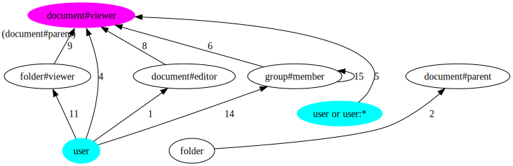
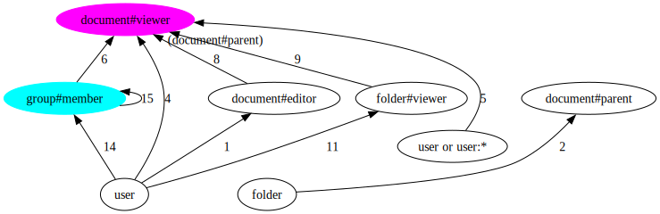
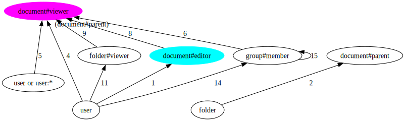
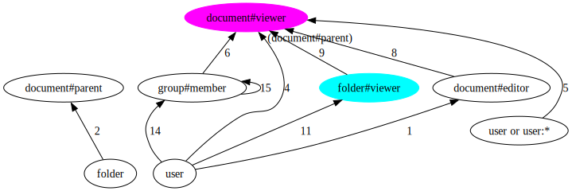

# ListObjects API implementation

An authorization model can be represented as a directed, possibly cyclical, graph. This graph shows the possible relationships between types (e.g. `user`) and usersets (eg `user:*`).

At a high level, answering ListObjects queries involves two phases:

- Phase 1: we draw the model and we do something similar to Breadth First Search. Starting at a given node and trying to reach a target node, we explore (reverse expand) all the paths that can lead to the target object type and relation. During this expansion, we read tuples and we include in the response all the objects that we find that are of the target type. Some of those objects will require further evaluation; we mark them as "candidates".
- Phase 2: all the "candidate" objects that require further evaluation, we call Check upon. If that Check returns `allowed=true`, we include them in the response.

> NOTE: In this example, phase 2 isn't necessary, so we'll exclude it. Please see `example_with_intersection_or_exclusion` to see how phase 2 works.

## Example:
Consider a store with the following authorization model:

```
type user

type group
  relations
    define member: [user, group#member]

type folder
  relations
    define viewer: [user]

type document
  relations
    define parent: [folder]
    define editor: [user]
    define viewer: [user, user:*, group#member] or editor or viewer from parent
```

We can represent this with a graph:


Consider the following 8 tuples: 

```html
document:1#viewer@user:andres
document:2#viewer@group:eng#member
document:3#editor@user:andres
document:4#parent@folder:1
document:5#viewer@user:*
folder:1#viewer@user:andres
group:eng#member@group:fga#member
group:fga#member@user:andres
```

Consider a ListObjects query like `ListObjects(type= document, relation= viewer, user= user:andres)`.

In phase 1, we do the following:

1. using the directed graph above, determine the edges between a source node (`user`) and target node (`document#viewer`),
2. using the tuples in the store to traverse those edges, do a BFS of the graph. Along the way, we add to the response the objects that we find, or we recursively examine the usersets that we find.

### Iteration 1

We determine all the possible paths between the source `user:andres` (in light blue) and the target `document#viewer` userset (in magenta). And then we look at the edges at distance 0 or 1 in those paths (from left to right, edges 11, 4, 1, 14, 5) and look at their tail node.



```go
// compute all paths, grab edges at distance 0 or 1, and grab their tails
Edges(user, document#viewer) → [group#member, document#viewer, document#editor, folder#viewer, document#viewer]
```

We have to explore each neighbor node separately. To do that, we iterate over tuples and find all of the objects connected from source object `user:andres` to each of those nodes. We do this using the ReverseExpand internal API: `ReverseExpand(source Object or Userset, neighbor Userset) -> Object or [Usersets]`

Since the edges mentioned are solid lines (i.e. direct relations), they are straightforward to compute:

```go
// find all tuples of form `group:...#member@user:andres`
a. ReverseExpand(user:andres, group#member) → [group:fga#member]

// find all tuples of form `document:...#viewer@user:andres`
b. ReverseExpand(user:andres, document#viewer) → [document:1#viewer]

// find all tuples of form `document:...#editor@user:andres`
c. ReverseExpand(user:andres, document#editor) → [document:3#editor]

// find all tuples of form `folder:...#viewer@user:andres`
d. ReverseExpand(user:andres, folder#viewer) → [folder:1#viewer]

// find all tuples of form `document:...#viewer@user:*`
e. ReverseExpand(user:*, document#viewer) → [document:5#viewer]
```

Next, we apply recursion on each userset we got.

### Iteration 2

#### 2a. ReverseExpand(group:fga#member, document#viewer)



```go
// compute all paths, grab edges at distance 0 or 1, and grab their tails
Edges(group#member, document#viewer) → [group#member, document#viewer]
```

We examine each neighbor node separately:

```go
// find all tuples of form `document:...#viewer@group:fga#member`
ReverseExpand(group:fga#member, document#viewer) → []

// find all tuples of form `group:X#member@group:fga#member`
ReverseExpand(group:fga#member, group#member) → [group:eng#member]
```

We will have to recurse through userset `group:eng#member` in a next iteration (3a).

#### 2b. ReverseExpand(document:1#viewer, document#viewer)

Here, both the source and target parameters are usersets of the same type and relation, which is the type of the original request. So, we can say we found an object `document:1`. We can immediately add it to the list of results and terminate the recursion in this branch.

#### 2c. ReverseExpand(document:3#editor, document#viewer)



```go
// compute all paths, grab edges at distance 0 or 1, and grab their tails
Edges(document:#editor, document#viewer) → [document#viewer]
```

Edge 8 from `document#editor` to `document#viewer` is a computed userset relation. This edge is special. It means that all editors are also viewers. We don't have to look for any tuples, we can just work on 

```go
ReverseExpand(document:3#viewer, document#viewer)
```

in a next iteration (3b).

#### 2d. ReverseExpand(folder:1#viewer, document#viewer)



```go
// compute all paths, grab edges at distance 0 or 1, and grab their tails
Edges(folder:1#viewer, document#viewer) → [document#viewer]
```

Edge 9 from the source `folder#viewer` (light blue) and the target `document#viewer` (magenta) is a tuple-to-userset rewrite, which is conditioned on the `document#parent` tupleset. This means that if someone can view a folder, and the document's parent is that folder, they can also view the document. 

In other words: we know that `user:andres` belongs to the `folder:1#viewer` group. Now we need to find all `document`s that `folder:1` is a parent of.

```go
// we know `folder:1#viewer@user:andres`
// find all tuples of form `document:...#parent@folder:1` and then return `document:...#viewer`
ReverseExpand(folder:1#viewer, document#viewer) → [document:4#viewer]
```

We will have to recurse through userset `document:4#viewer` in a next iteration (3c).

#### 2e. ReverseExpand(document:5#viewer, document#viewer)

Here, both the source and target parameters are usersets of the same type and relation, which is the type of the original request. So, we can say we found an object `document:5`. We can immediately add it to the list of results and terminate the recursion in this branch.

### Iteration 3

We examine usersets left from the previous iteration.

#### 3a. ReverseExpand(group:eng#member, document#viewer)

<!-- 
digraph G {
    
    rankdir=BT
    
  "group#member"  [style=filled,fillcolor=lightblue]
    
  "folder#viewer" 
  
  "document#viewer" [style=filled,fillcolor=magenta]

  user -> "group#member"
  
  "group#member" -> "group#member" [color=red]
  
  "group#member" -> "document#viewer"  [color=red]
  
  user -> "document#editor"
  
  user -> "document#viewer"
  
  "document#editor" -> "document#viewer" [style=dotted]
  
  user -> "folder#viewer"
  
  "folder#viewer" -> "document#viewer"  [style=dashed]
  
  folder -> "document#parent" 
  
  "folder#viewer" -> "document#parent"
  
  "user:*" -> "document#viewer"
}
-->


```go
// compute all paths, grab edges at distance 0 or 1, and grab their tails
Edges(group#member, document#viewer) → [group#member, document#viewer]
```

We examine each neighbor node separately:

```go
// find all tuples of form `document:...#viewer@group:eng#member`
ReverseExpand(group:eng#member, document#viewer) → [document:2#viewer]

// find all tuples of form `group:X#member@group:eng#member`
ReverseExpand(group:eng#member, group#member) → []
```

We will have to recurse through userset `document:2#viewer` in a next iteration (4a).

#### 3b. ReverseExpand(document:3#viewer, document#viewer)

Both the source and target parameters are usersets of the same type and relation, and they match the original request. So, we found an object `document:3`. We can immediately add it to the list of results and terminate the recursion in this branch.

#### 3b. ReverseExpand(document:4#viewer, document#viewer)

Both the source and target parameters are usersets of the same type and relation, and they match the original request. So, we found an object `document:4`. We can immediately add it to the list of results and terminate the recursion in this branch.

### Iteration 4

#### 4a. ReverseExpand(document:2#viewer, document#viewer)

Both the source and target parameters are usersets of the same type and relation, and they match the original request. So, we found an object `document:2`. We can immediately add it to the list of results and terminate the recursion in this branch.

### Result

Since there were no leftover usersets that were pending further recursion, we can return a final response:

```go
ListObjects(type= document, relation= viewer, user= user:andres) → [document:1, document:2, document:3, document:4, document:5]
```