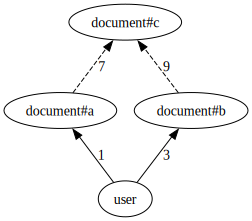
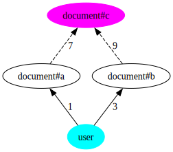
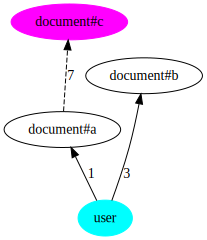
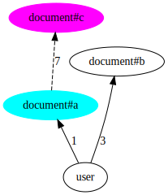

# ListObjects API with intersection or exclusion implementation

An authorization model can be represented as a directed, possibly cyclical, graph. This graph shows the possible relationships between types (e.g. `user`) and usersets (eg `user:*`).

At a high level, answering ListObjects queries involves two phases:

- Phase 1: we draw the model and we do something similar to Breadth First Search. Starting at a given node and trying to reach a target node, we explore (reverse expand) all the paths that can lead to the target object type and relation. During this expansion, we read tuples and we include in the response all the objects that we find that are of the target type. Some of those objects will require further evaluation; we mark them as "candidates".
- Phase 2: all the "candidate" objects that require further evaluation, we call Check upon. If that Check returns `allowed=true`, we include them in the response.


## Example
Consider the following model:

```
type user

type document
   relations
     define a: [user]
     define b: [user]
     define c: a and b
```



And these tuples:

```go
document:1#a@user:andres
document:1#b@user:andres
```

The query is `ListObjects(user= user:andres, relation=document, type=c)` and the expected answer is `[document:1]`.

In phase 1, we do the following:

1. using the directed graph above, determine the edges between a source node (`user`) and target node (`document#c`),
2. using the tuples in the store to traverse those edges, do a BFS of the graph. Along the way, we add to the response the objects that we find, or we recursively examine the usersets that we find, or we mark candidate objects for further evaluation.

### Phase 1

#### Iteration 1

We have to determine all the possible paths between the source `user:andres` (in light blue) and the target `document#c` userset (in magenta). 



But, because `document#c` is defined as an intersection, first we remove all incoming edges of `document#c`, except the first one (edge 7).

> NOTE: if `document#c` were defined as an exclusion, we would do the same.

The pruned graph looks like this:



```go
// compute all paths, grab edges at distance 0 or 1, and grab their tails
Edges(user, document#c) → [document#a]
```


We have to explore each neighbor node separately. To do that, we iterate over tuples and find all of the objects connected from source object `user:andres` to each of those nodes. We do this using the ReverseExpand internal API: `ReverseExpand(source Object or Userset, neighbor Userset) -> Object or [Usersets]`

Since the edges mentioned are solid lines (i.e. direct relations), they are straightforward to compute:

```go
// find all tuples of form `document:...#a@user:andres`
a. ReverseExpand(user:andres, document#a) → [document:1#a]
```

Next, we apply recursion on each userset we got.

#### Iteration 2

#### 2a. ReverseExpand(document:1#a, document#c)



```go
// compute all paths, grab edges at distance 0 or 1, and grab their tails
Edges(document:#a, document#c) → [document#c]
```

Edge 7 from `document#a` to `document#c` is a computed userset relation. This edge is special. We don't have to look for any tuples, we can just work on 

```go
ReverseExpand(document:1#c, document#c)
```
in a next iteration (3a).

#### Iteration 3

#### 3a. ReverseExpand(document:1#c, document#c)

Here, both the source and target parameters are usersets of the same type and relation, which is the type of the original request. So, we can say we found an object `document:5`. 

However, because the path we did to get to this point included pruning the graph, we can't immediately add `document:1` to the list of results. We add it to a list of candidate objects and move to phase 2.

```go
Candidate Objects → [document:1]
```

### Phase 2

In this phase we have to call Check on each candidate object.

```go
Check(user:andres, c, document:1) → {allowed: true}
```

Because of this response, we can add `document:1` to the list of results.

### Result

Since there were no leftover usersets that were pending further recursion and we further examined each candidate object, we can return a final response:

```go
ListObjects(type= document, relation= c, user= user:andres) → [document:1]
```