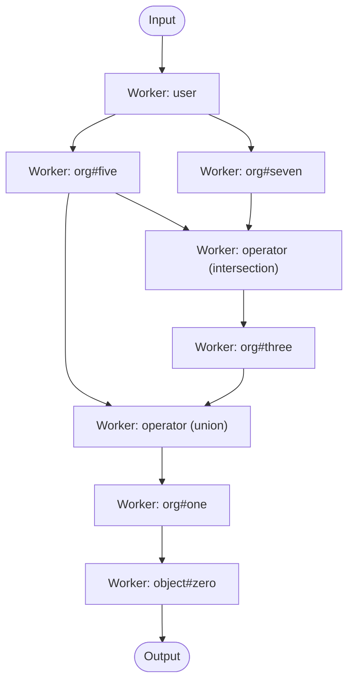

# Pipeline Traversal

The Pipeline instance is initialized by invoking `New()` with a weighted authorization model `Graph`, an `ObjectReader` implementation, and functional options to configure `chunkSize`, `bufferCapacity`, `numProcs`, and pipe extension settings.

```go
validator := obj.NewValidator(ctx, typesys, req.GetContext())

reader := obj.NewReader(
    ds,
    req.GetStoreId(),
    obj.WithConsistency(req.GetConsistency()),
    obj.WithValidator(validator),
)

pl := pipeline.New(
    wgraph,
    reader,
    pipeline.WithBufferCapacity(bufferCapacity),
    pipeline.WithChunkSize(chunkSize),
    pipeline.WithNumProcs(numProcs),
    pipeline.WithPipeExtension(pipeExtendAfter, pipeMaxExtensions),
)
```

Storage access is abstracted behind the `reader`, which handles creating a storage iterator, and applying a validation pipeline (condition evaluation + invalid tuple filtering). This abstraction decouples the pipeline's graph traversal from the specifics of the datastore.

Once initialized, a ListObjects request can be processed by invoking `pl.Expand()` with a `Spec` containing the object type, relation, and user.

```go
spec := pipeline.Spec{
    ObjectType: "object",
    Relation:   "zero",
    User:       "user:01ARZ3NDEKTSV4RRFFQ69G5FAV",
}

seq, err := pl.Expand(context.Background(), spec)
if err != nil {
    return fmt.Errorf("pipeline error: %w", err)
}

var results []string
for object := range seq {
    id, err := object.Object()
    if err != nil {
        return fmt.Errorf("pipeline error: %w", err)
    }
    results = append(results, id)
}
```

The `Expand()` method builds the pipeline workers by traversing the weighted graph in a DFS, starting at the source object type and relation, creating a worker for each node until a node has no more edges, at which point it backtracks and continues from the previous unexplored edge. Nodes are stored as pointers in the workers, so nodes that were previously traversed are not traversed again.

Eg, for the following model, with the source `object#zero` and the target `user:01ARZ3NDEKTSV4RRFFQ69G5FAV`, workers would be added in numerical order. Note that there are missing numbers for when a union/intersection/exclusion node would be added, as well as when the user node is added. Additionally, in the case of a TTU edge, the parent node is not added as a worker.
```yaml
model
  schema 1.1

type user

type org
  relations
    define five: [user]
    define seven: [user]
    define three: five and seven
    define one: three or five

type team
  relations
    define ten: [user]
    define eight: ten or three from parent
    define parent: [org]

type object
  relations
    define zero: [org#one, team#eight]
```

This model can also be represented as a graph:

<p align="center">
    
</p>

## Worker and Resolver Architecture

Each node in the authorization graph is represented by a **worker**. Workers communicate through typed **sender** and **listener** connections backed by bounded ring-buffer pipes. Each worker processes messages from its senders and forwards results to its listeners.

For example in the above model, the `org#five` worker node would have the sender edges `[]edge{{ from: "org#five", to: "user" }}` and the listener edges `[]edge{{ from: "intersection", to: "org#five" }, { from: "union", to: "org#five" }}` in pseudocode.

Every worker delegates its processing logic to a **resolver**. Resolvers implement the `resolver` interface with a single `Resolve(ctx, senders, listeners)` method. The `createResolver()` function in `util.go` selects the appropriate resolver based on the node type:

| Node Type | Resolver | Behavior |
|---|---|---|
| `SpecificType`, `SpecificTypeAndRelation`, `SpecificTypeWildcard`, `LogicalDirectGrouping`, `LogicalTTUGrouping` | `baseResolver` | General-purpose concurrent processing with output deduplication |
| Operator (`union`) | `baseResolver` | Same as above; union is a natural merge of results |
| Operator (`intersection`) | `intersectionResolver` | Collects all inputs then computes set intersection |
| Operator (`exclusion`) | `exclusionResolver` | Streams include side, collects exclude side, then filters |

### Edge Interpreter

Within each resolver, an **edge interpreter** dispatches the actual storage queries (or identity pass-throughs) based on the edge type. The `edgeInterpreter` contains three handlers:

| Handler | Edge Types | Behavior |
|---|---|---|
| `directEdgeHandler` | `DirectEdge` | Queries the datastore using the edge's relation definition and conditions |
| `ttuEdgeHandler` | `TTUEdge` | Resolves via the tupleset relation; looks up the tupleset node and its target edge in the graph |
| `identityEdgeHandler` | `ComputedEdge`, `RewriteEdge`, `DirectLogicalEdge`, `TTULogicalEdge` | Passes items through unchanged without querying the datastore |

### Message Flow

For the `object#zero` path to `user` through the `org#one` relation, we can use the following graph to trace message passing:



When the pipeline starts, an initial message is sent to all of the nodes with the same user type as the target, ie `user` receives the message `user:01ARZ3NDEKTSV4RRFFQ69G5FAV`, to kick off the message processing. As a result, any of the workers with senders coming from `user` receive the message `user:01ARZ3NDEKTSV4RRFFQ69G5FAV`. Their resolvers dispatch to the edge interpreter, which uses the `directEdgeHandler` to query the datastore for objects matching the edge's relation, eg `org#five`. If `org#five` does have objects for the user type, those objects are broadcast to the worker's listeners in batches up to the `chunkSize`. Finally, when messages reach the source worker (`object#zero`), or if errors are encountered anywhere along the way, they are returned in the resulting stream of `Item` values.

After construction, the pipeline waits for all workers to finish processing their goroutines, at which time the workers cancel their contexts and close all of their listeners. Closing the listeners uses a broadcast-style mechanism to mark pipes as done, wake any goroutines blocked on writes or reads, and end their goroutines.

A few parts of the algorithm have special considerations to note when the model includes `intersection` operators, `exclusion` operators, `TTU edges`, and `cyclic edges`.

## Intersection and Exclusion

During intersection and exclusion evaluation, execution is blocked until all messages are processed since their operation cannot be logically performed until the relations on either side are processed. This blocking behavior can create a performance bottleneck, especially when a branch of the intersection/exclusion takes significantly longer to evaluate than the other, as the faster branch must wait for the slower one to complete. For example, in the following relation from earlier

### Intersection

```yaml
type org
  relations
    define five: [user]
    define seven: [user]
    define three: five and seven
```

In order to determine whether there are objects in the `org#three` relation that may result in returning objects for the ListObjects call higher up the graph for the root `object#zero` relation, both the `org#five` and `org#seven` relation must have objects for the `user:01ARZ3NDEKTSV4RRFFQ69G5FAV` user. In the pipeline, intersection handling blocks until all `org#five` and `org#seven` objects are received as messages, then compares the found objects to ensure that they exist for both relations, and removes duplicates. As an example, for the `org#three` relation to have the `"org:a"` object, the following tuples would have to exist:

```jsonc
{ "user": "user:01ARZ3NDEKTSV4RRFFQ69G5FAV", "relation": "five", "object": "org:a" }
{ "user": "user:01ARZ3NDEKTSV4RRFFQ69G5FAV", "relation": "seven", "object": "org:a" }
```

### Exclusion

For exclusion, we can convert the above relation:

```yaml
type org
  relations
    define five: [user]
    define seven: [user]
    define three: five but not seven
```

Determining whether objects in `org#three` exist still requires knowing all of the objects for `org#five` and `org#seven`, however only tuples that exist in `org#five` but do not exist in `org#seven` would satisfy the `org#three` relation. For the exclusion operator, there is an optimization that reduces how long the operator has to wait before sending messages. The include side of the operator is processed and staged into an internal pipe, while the exclude side of the operator is blocked until all messages are received. As soon as the exclude side completes, the staged include stream is drained and filtered for any objects present in the exclude list. This means that messages in the include list can be compared against the exclude list and sent to be processed upstream immediately after the exclude list has been completed, without waiting for the include list to complete, unlike the intersection operator.

Finally for both operators, the objects that meet the operator conditions are sent to their listeners as messages in batches defined by the `chunkSize`.

## TTU Edge

In Tuple To Userset (TTU) relations, the object relation must be converted to the tupleset relation based on the edge. Eg, in the relations defined earlier

```yaml
type team
  define eight: ten or three from parent
  define parent: [org]
```

In pseudocode, the `TTUEdge` would be `edge{ from: "union", to: "org#three", tuplesetRelation: "team#parent" }`. So if the object `"org:b"` was found to exist for the `org#three` relation, the next database query would require a look up for any objects in the `team#parent` relation with the user type `"org:b"`. In otherwords, if we had an object `"object:TTU"` connected via TTU, all of the following tuples would need to exist:

```jsonc
<!-- These tuples satisfy the "org#three" relation -->
{ "user": "user:01ARZ3NDEKTSV4RRFFQ69G5FAV", "relation": "five", "object": "org:b"}
{ "user": "user:01ARZ3NDEKTSV4RRFFQ69G5FAV", "relation": "five", "object": "org:b"}

<!-- This tuple satisfies the "team#parent" TTU -->
{ "user": "org:b", "relation": "parent", "object": "team:a" }

<!-- This tuple would result in list objects returning "object:TTU" -->
{ "user": "team:a#eight", "relation": "zero", "object": "object:TTU" }
```

## Cyclic Edge

Cyclic edges present a unique challenge where messages can loop indefinitely through the cycle. Without special handling, workers wouldn't know when to stop processing. Consider the following model with a tuple cycle:
```yaml
model
  schema 1.1

type user

type object
  relations
    define cycle: [object#zero]
    define zero: [user, object#cycle]
```
<p align="center">
    
</p>

The pipeline algorithm addresses the concerns of cyclic edges in a few ways:

1. **Input deduplication**
   - When an edge is cyclical, an input buffer is shared across all goroutines processing that sender to prevent re-processing the same items as they loop through the cycle. Items that have already been seen by the sender are skipped.
2. **Shared message tracking and status**
    - When the graph is first being traversed and a cyclical path is encountered, a cycle group is created. All workers that belong to the same cycle join this group so they can coordinate with each other.
    - The group contains two shared primitives: a **message counter** that tracks how many messages are currently in-flight across the entire cycle, and a **status pool** that each worker uses to report whether it still has non-cyclical work remaining.
    - Every time a message is sent into the cycle the counter is incremented, and every time a message finishes processing it is decremented. Workers outside of a cycle get their own independent single-member group, so their lifecycle does not interfere with the cycle's coordination.
3. **Coordinated shutdown sequence**
    - Each worker in the cycle first processes all of its non-cyclical senders and waits for them to complete.
    - Once a worker's non-cyclical inputs are exhausted, it signals to the group that it is ready to shut down.
    - The worker then waits until every other worker in the cycle has also signaled ready. At this point, no new messages can enter the cycle from outside.
    - Next, the worker waits for the shared in-flight message counter to reach zero, meaning every message that was circulating through the cycle has been fully processed.
    - Finally, the worker closes its listeners, which unblocks any goroutines that were still waiting on full buffers for the cyclical senders, and waits for those goroutines to finish.

## Performance Tuning

The pipeline's performance can be tuned using the following configuration settings:

1. **`numProcs`** (`WithNumProcs`) limits the number of messages that are processed concurrently and sent to worker's senders to get database entries for the objects that relate to the messages. 
    - Larger means more goroutines competing for messages from the same sender, increasing throughput but also scheduling overhead
    - Smaller means fewer goroutines, less contention but potentially lower throughput
2. **`bufferCapacity`** (`WithBufferCapacity`) sets the capacity of the ring-buffer pipes that connect workers. This limits how many messages a sender can queue for its listeners before blocking.
    - Implemented as a circular ring buffer for efficient message passing between workers
    - Must be a power of 2. The internal ring buffers employ bit-masking optimizations that make this a requirement
    - Larger means more messages can queue which results in less blocking but more memory usage
    - Smaller means more backpressure, ie more blocking and less memory usage
3. **`chunkSize`** (`WithChunkSize`) limits the number of objects that are packed into each message to be sent to the listeners and subsequently processed in batches by the database.
    - The optimal value can vary depending on the query overhead of your database
    - Larger means fewer messages with more items per message, less overhead but larger memory usage per message
    - Smaller means more messages with fewer items per message, more overhead but less memory usage per message
4. **`extendAfter`** and **`maxExtensions`** (`WithPipeExtension`) enable dynamic growth of the internal buffers for the per-edge pipes that connect workers, disabled by default. These settings are used to reduce backpressure/deadlocks when downstream processing is slower than upstream sending.
    - A pipe is extended only if a sender blocks for longer than the duration of `extendAfter`.
    - Each extension doubles the pipe's internal capacity and caps the number of doublings by `maxExtensions`
    - `extendAfter` can be set to a negative value for disabled, or any non-negative duration for enabled
    - `maxExtensions` can be set to `-1` for unbounded extensions, `0` for disabled, or any positive value for a cap
    - Using these settings can help with bursty workloads, highly variable datastore latency, or uneven branch runtimes (eg, one side of an intersection/exclusion is much slower and causes backpressure)
    - However, using these settings can result in higher memory usage due to doubling the buffers of multiple edges