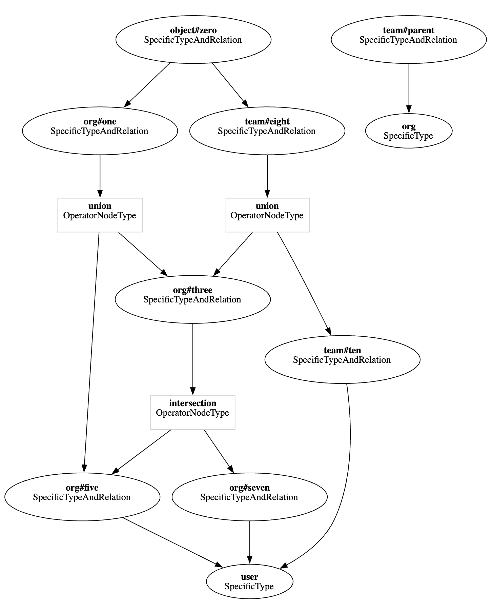
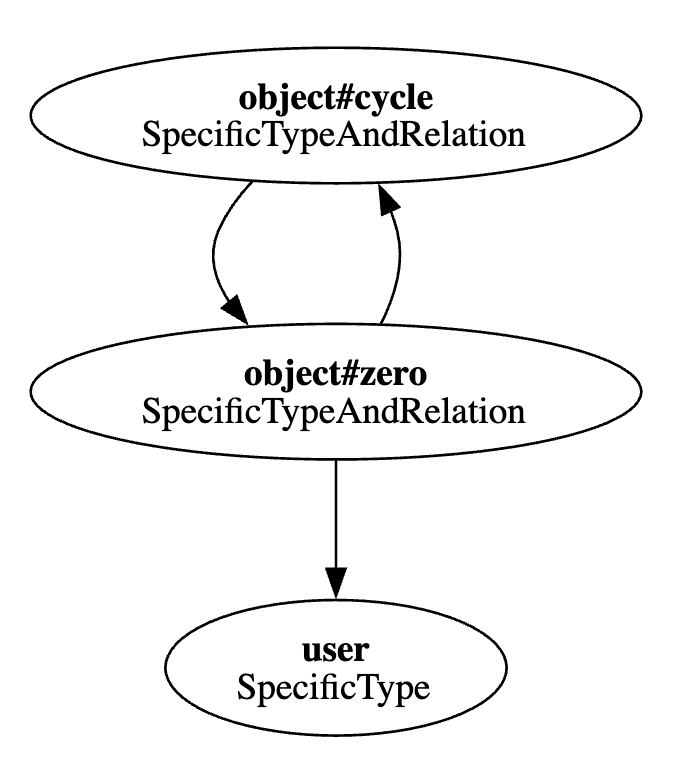

# Pipeline Traversal

The Pipeline instance is initialized by invoking `New()` with a `Backend` and options to set `chunkSize`, `bufferSize`, `numProcs`, `pipeExtendAfter` and `pipeMaxExtensions`.

Eg:
```
backend := &pipeline.Backend{
    Datastore:  ds,
    StoreID:    req.GetStoreId(),
    TypeSystem: typesys,
    Context:    req.GetContext(),
    Graph:      wgraph,
    Preference: req.GetConsistency(),
}

pl := pipeline.New(backend, WithBufferSize(bufferSize), WithChunkSize(chunkSize), WithNumProcs(numProcs), WithPipeExtension(pipeExtendAfter, pipeMaxExtensions))
```

Once initialized, a ListObjects request can be processed by invoking `pl.Build()` with the object type and relation as the `source`, and the user and ID as the `target`. 
```
target, ok := pl.Target("user", "01ARZ3NDEKTSV4RRFFQ69G5FAV")
source, ok := pl.Source("object", "zero")

seq := pl.Build(context.Background(), source, target)

var results []string
for item := range seq {
    if item.Err != nil {
        fmt.Errorf("pipeline error: %w", err)
    }
    results = append(results, item.Value)
}
```

The `Build()` method builds the pipeline workers by traversing the weighted graph in a DFS, starting at the source object type and relation, creating a worker for each node until a node has no more edges, at which point it backtracks and continues from the previous unexplored edge. Nodes are stored as pointers in the workers, so nodes that were previously traversed are not traversed again.

Eg, for the following model, with the source `object#zero` and the target `user:01ARZ3NDEKTSV4RRFFQ69G5FAV`, workers would be added in numerical order. Note that there are missing numbers for when a union/intersection/exclusion node would be added, as well as when the user node is added. Additionally, in the case of a TTU edge, the parent node is not added as a worker.
```
model
    schema 1.1

type user

type org
    relations
    define five: [user]
    define seven: [user]
    define three: five and seven
    define one: three or five

type team
    relations
    define ten: [user]
    define eight: ten or three from parent
    define parent: [org]

type object
    relations
    define zero: [org#one, team#eight]
```

This model can also be represented as a graph:

<p align="center">
    
</p>

Workers connect the graph path from source to target using sender and listener edges. Each worker processes messages from its senders and forwards results to its listeners. For example in the above model, the `org#five` worker node would have the sender edges `[]edge{{ from: "org#five", to: "user" }}` and the listener edges `[]edge{{ from: "intersection", to: "org#five" }, { from: "union", to: "org#five" }}` in pseudocode. Workers also set up node and edge type specific message handling, remain open while their senders may still be fetching or processing messages, and close themselves and their listeners once processing is complete.

When the pipeline is building, an initial message is sent to all of the nodes with the same user type as the target, ie `user` receives the message `user:01ARZ3NDEKTSV4RRFFQ69G5FAV`, to kick off the message processing. As a result, any of the workers with listeners going to `user` receive the message `user:01ARZ3NDEKTSV4RRFFQ69G5FAV` and start making queries to the database to determine whether the edge they're going to has objects that relate to the user, eg `org#five`. If `org#five` does have objects for the user type, those objects are sent to their listeners in batches up to the size defined for the pipeline `chunkSize` and processed in a single database query. Finally, when messages are returned that connect to the source worker, in this case `object#zero`, or if errors are encountered anywhere along the way, they are returned in the resulting stream of `Item` values.

After construction, the pipeline waits for all workers to finish processing their goroutines, at which time the workers cancel their contexts and close all of their listeners. Closing the listeners uses a broadcast-style mechanism to mark pipes as done, wake any goroutines blocked on writes or reads, and end their goroutines.

A few parts of the algorithm have special considerations to note when the model includes `intersection` operators, `exclusion` operators, `TTU edges`, and `cyclic edges`.

## Intersection and Exclusion

During intersection and exclusion evaluation, execution is blocked until all messages are processed since their operation cannot be logically performed until the relations on either side are processed. This blocking behavior can create a performance bottleneck, especially when a branch of the intersection/exclusion takes significantly longer to evaluate than the other, as the faster branch must wait for the slower one to complete. For example, in the following relation from earlier

```
type org
    relations
    define five: [user]
    define seven: [user]
    define three: five and seven
```

In order to determine whether there are objects in the `org#three` relation that may result in returning objects for the ListObjects call higher up the graph for the root `object#zero` relation, both the `org#five` and `org#seven` relation must have objects for the `user:01ARZ3NDEKTSV4RRFFQ69G5FAV` user. In the pipeline, intersection handling blocks until all `org#five` and `org#seven` objects are received as messages, then compares the found objects to ensure that they exist for both relations, and removes duplicates. As an example, for the `org#three` relation to have the `"org:a"` object, the following tuples would have to exist:

```
{ user: "user:01ARZ3NDEKTSV4RRFFQ69G5FAV", relation: "five", object: "org:a" }
{ user: "user:01ARZ3NDEKTSV4RRFFQ69G5FAV", relation: "seven", object: "org:a" }
```

For exclusion, we can convert the above relation

```
type org
    relations
    define five: [user]
    define seven: [user]
    define three: five but not seven
```

Determining whether objects in `org#three` exist still requires knowing all of the objects for `org#five` and `org#seven`, however only tuples that exist in `org#five` but do not exist in `org#seven` would satisfy the `org#three` relation. For the exclusion operator, there is an optimization that reduces how long the operator has to wait before sending messages. The include side of the operator is processed and staged into an internal pipe, while the exclude side of the operator is blocked until all messages are received. As soon as the exclude side completes, the staged include stream is drained and filtered for any objects present in the exclude list. This means that messages in the include list can be compared against the exclude list and sent to be processed upstream immediately after the exclude list has been completed, without waiting for the include list to complete, unlike the intersection operator.

Finally for both operators, the objects that meet the operator conditions are sent to their listeners as messages in batches defined by the `chunkSize`.

## TTU Edge

In Tuple To Userset (TTU) relations, the object relation must be converted to the tupleset relation based on the edge. Eg, in the relations defined earlier

```
type team
    define eight: ten or three from parent
    define parent: [org]
```

In pseudocode, the `TTUEdge` would be `edge{ from: "union", to: "org#three", tuplesetRelation: "team#parent" }`. So if the object `"org:b"` was found to exist for the `org#three` relation, the next database query would require a look up for any objects in the `team#parent` relation with the user type `"org:b"`. In otherwords, if we had an object `"object:TTU"` connected via TTU, all of the following tuples would need to exist:

```
<!-- These tuples satisfy the "org#three" relation -->
{ user: "user:01ARZ3NDEKTSV4RRFFQ69G5FAV", relation: "five", object: "org:b"}
{ user: "user:01ARZ3NDEKTSV4RRFFQ69G5FAV", relation: "five", object: "org:b"}

<!-- This tuple satisfies the "team#parent" TTU -->
{ user: "org:b", relation: "parent", object: "team:a" }

<!-- This tuple would result in list objects returning "object:TTU" -->
{ user: "team:a#eight", relation: "zero", object: "object:TTU" }
```

## Cyclic Edge

Cyclic edges present a unique challenge where messages can loop indefinitely through the cycle. Without special handling, workers wouldn't know when to stop processing. Consider the following model with a tuple cycle:
```
model
    schema 1.1

	type user

	type object
		relations
		define cycle: [object#zero]
		define zero: [user, object#cycle]
```
<p align="center">
    
</p>

The pipeline algorithm addresses the concerns of cyclic edges in a few ways:
1. Input deduplication
   - When an edge is part of a cycle, an input buffer is shared across all goroutines processing that sender to prevent re-processing the same items as they loop through the cycle.
3. Shared message tracking and status
    - Cyclic edges share the same message tracking and status instances, whereas non-cyclic edges create new instances. This enables coordinating shutdown where: 
    - Shared message tracking counts in-flight messages across the entire cycle
    - Shared status enables each worker to report that it is finished non-cyclical work
4. Separate processing queue and termination logic
    - A cyclic edge uses a separate processing queue to allow it to coordinate shutdown logic. When the cyclic edge is handling termination, it waits for all of the status entries to be done so that all of the non-cyclical messages are known to be finished processing, and for the shared tracker to finish so that all in-flight messages are also known to be processed.

## Performance Tuning

The pipeline's performance can be tuned using three configuration settings:
1. `numProcs` limits the number of messages that are processed concurrently and sent to worker's senders to get database entries for the objects that relate to the messages. 
    - Larger means more goroutines competing for messages from the same sender
    - Smaller means fewer goroutines, less contention
2. `bufferSize` limits the number of messages that a sender can send to its listeners once the sender has received the objects from the database.
    - Implemented as a circular ring buffer for efficient message passing between workers
    - Must be a power of 2 to enable efficient bitwise masking for index wrapping
    - Larger means more messages can queue which results in less blocking but more memory usage
    - Smaller means more backpressure, ie more blocking and less memory usage
3. `chunkSize` limits the number of objects that are packed into each message to be sent to the listeners and subsequently processed in batches by the database.
    - The optimal value can vary depending on the query overhead of your database
    - Larger means fewer messages with more items per message, less overhead but larger memory usage per message
    - Smaller means more messages with fewer items per message, more overhead but less memory usage per message
4. `pipeExtendAfter` and `pipeMaxExtensions` are settings for enabling dynamic growth of the internal buffers for the per-edge pipes that connect workers, disabled by default. These settings are used to reduce backpressure/deadlocks when downstream processing is slower than upstream sending.
    - A pipe is extended only if a sender blocks for longer than the duration of `extendAfter`.
    - Each extension doubles the pipe's internal `bufferSize` and caps the number of doublings by `maxExtensions`
    - `extendAfter` can be set to `-1` for disabled, or any value greater for enabled
    - `maxExtensions` can be set to `-1` for unbounded extensions, `0` for disabled, or any value greater for enabled
    - Using these settings can help with bursty workloads, highly variable datastore latency, or uneven branch runtimes (eg, one side of an intersection/exclusion is much slower and causes backpressure)
    - However, using these settings can result in higher memory usage due to doubling the buffers of multiple edges