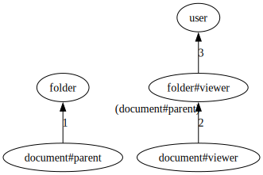

# ListUsers API implementation

An authorization model can be represented as a directed, possibly cyclical, graph. This graph shows the possible relationships between types (e.g. `user`) and usersets (eg `user:*`, `group:fga#member`).

At a high level, answering ListUsers queries involves two phases:

- Phase 1: we draw the model and we do something similar to Breadth First Search. Starting at a source and trying to reach a target node, we explore (forward expand) all the paths that can lead to the target object type. During this expansion, we read tuples and we include in the response all the subjects that we find that are of the target type. Some of those objects will require further evaluation; we mark them as "candidates".
- Phase 2: all the "candidate" objects that require further evaluation, we call Check upon. If that Check returns `allowed=true`, we include them in the response.

> NOTE: In this example, phase 2 isn't necessary because the model has no intersections or exclusions, so we'll exclude it. Please see `example_with_intersection_or_exclusion` to see how phase 2 works.

## Example model
Consider a store with the following authorization model:

```
model
    schema 1.1
type user

type folder
    relations
        define viewer: [user]

type document
    relations
        define parent: [folder]
        define viewer: viewer from parent
```

We can represent this with a graph:



Consider the following 2 tuples: 

```html
document:1#parent@folder:x
folder:x#viewer@user:andres
```

## Example 1: ListUsers(object= document:1, relation= viewer, filter=[folder])

In phase 1, we do the following:

1. using the directed graph above, determine the edges between a source node (`document#viewer`) and target node (`user`),
2. using the tuples in the store to traverse those edges, do a BFS of the graph. Along the way, we add to the response the objects that we find, or we recursively examine the usersets that we find.

### Iteration 1

We determine all the possible paths between the source `document#viewer` and the target `folder`.

There is no connectivity between these two nodes.

```go
// compute all paths, grab edges at distance 0 or 1, and grab their tails
Edges(document#viewer, folder) → []
```

### Result
Since there were no leftover usersets that were pending further recursion, we can return a final response:

```go
ListUsers(object= document:1, relation= viewer, filter=[folder]) → []
```

