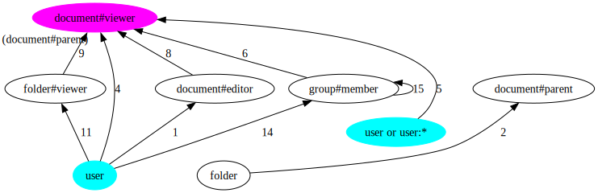
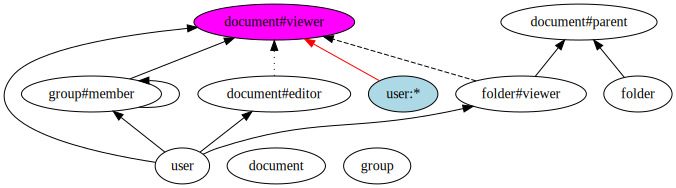
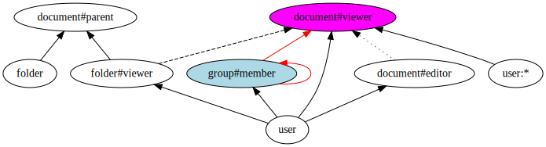

# ListObjects API implementation

At a high level, answering ListObjects queries involves a reverse expansion algorithm. Thinking of an authorization model as a directed graph and the tuples as the way of "moving" through that graph, we start the search from a specific object and explore (reverse expand) all the paths that can lead to the target object type and relation. During this expansion, we add to the final response all the concrete objects that we find that are of the target type. And if we discover usersets that don't match the target type and relation, we process those further.

## Example 1: model with wildcard, union, computed usersets and tuple-to-usersets
Consider the following model:

```
type user

type group
  relations
    define member: [user, group#member]

type folder
  relations
    define viewer: [user]

type document
  relations
    define parent: [folder]
    define editor: [user]
    define viewer: [user, user:*, group#member] or editor or viewer from parent
```

We can represent this with a graph of types (e.g. `user`) and usersets (eg `user:*`):

<!--
digraph G {
    
  rankdir=BT

  document
  
  group
  
  user -> "document#viewer"
  
  user -> "group#member"
  
  "group#member" -> "group#member"
  
  "group#member" -> "document#viewer"
  
  user -> "document#editor"
  
  "document#editor" -> "document#viewer" [style=dotted]
  
  user -> "folder#viewer"
  
  "folder#viewer" -> "document#viewer"  [style=dashed]
  
  folder -> "document#parent"
  
  "folder#viewer" -> "document#parent"
  
  "user:*" -> "document#viewer"
}
-->


(Solid lines represent direct relationships. Dotted lines represent relationships via computed usersets. Dashed lines represent relationships via tuple-to-usersets)

And consider a store with the following 8 tuples: 

```html
document:1#viewer@user:andres
document:2#viewer@group:eng#member
document:3#editor@user:andres
document:4#parent@folder:1
document:5#viewer@user:*
folder:1#viewer@user:andres
group:eng#member@group:fga#member
group:fga#member@user:andres
```

Answering a ListObjects query like `ListObjects(type= document, relation= viewer, user= user:andres)` consists of applying the following steps:

1. using the directed graph above, determine the edges between a source node and target node,
2. using the tuples in the store to traverse those edges, explore the graph. Here, we either add found objects to the response or we add usersets to a list of that needs further expansion.

### Iteration 1

We determine all the possible paths between the source `user:andres` (in light blue) and the target `document#viewer` userset (in magenta). And then we look at the edges at distance 0 or 1 in those paths (in red):

<!--
digraph G {
    
    rankdir=BT
    
  user [style=filled,fillcolor=lightblue]

  document
  
  group
  
  "user:*" -> "document#viewer"
  
  "document#viewer" [style=filled,fillcolor=magenta]

  user -> "group#member" [color=red]
  
  "group#member" -> "group#member" []
  
  "group#member" -> "document#viewer" []
  
  user -> "document#editor" [color=red]
  
  user -> "document#viewer" [color=red]
  
  "document#editor" -> "document#viewer" [style=dotted]
  
  user -> "folder#viewer" [color=red]
  
  "folder#viewer" -> "document#viewer"  [style=dashed]
  
  folder -> "document#parent" 
  
  "folder#viewer" -> "document#parent"
}
-->



```go
// compute all paths, grab edges at distance 0 or 1, and grab their tails
NodesDistance0Or1(user, document#viewer) → [group#member, document#viewer, document#editor, folder#viewer]
```

We have to explore each neighbor node separately. To do that, we iterate over tuples and find all of the objects connected from source object `user:andres` to each of those nodes. We do this using the ConnectedObjects internal API: `ConnectedObjects(source Object or Userset, target Userset) -> [Usersets]`

Since the four edges mentioned are solid lines (i.e. direct relations), they are straightforward to compute:

```go
// find all tuples of form `group:...#member@user:andres`
a. ReverseExpand(user:andres, group#member) → [group:fga#member]

// find all tuples of form `document:...#viewer@user:andres`
b. ReverseExpand(user:andres, document#viewer) → [document:1#viewer]

// find all tuples of form `document:...#editor@user:andres`
c. ReverseExpand(user:andres, document#editor) → [document:3#editor]

// find all tuples of form `folder:...#viewer@user:andres`
d. ReverseExpand(user:andres, folder#viewer) → [folder:1#viewer]
```

Notice how there is also an edge from `user:*` (remember our source user was `user:andres`) to `document#viewer`.

<!--
digraph G {
    
    rankdir=BT
    
  user
  
  document
  
  group
  
  "user:*" -> "document#viewer" [color=red]
  
  "document#viewer" [style=filled,fillcolor=magenta]

  user -> "group#member"
  
  "group#member" -> "group#member"
  
  "group#member" -> "document#viewer" 
  
  user -> "document#editor"
  
  user -> "document#viewer" 
  
  "document#editor" -> "document#viewer" [style=dotted]
  
  user -> "folder#viewer"
  
  "folder#viewer" -> "document#viewer"  [style=dashed]
  
  folder -> "document#parent" 
  
  "folder#viewer" -> "document#parent"
  
  "user:*"  [style=filled,fillcolor=lightblue]
}
-->



```go
// compute all paths, grab edges at distance 0 or 1, and grab their tails
NodesDistance0Or1(user:*, document#viewer) → [document#viewer]
```

So we have to examine this too, which is simple because it's a direct relation:

```go
// find all tuples of form `document:...#viewer@user:*`
e. ReverseExpand(user:*, document#viewer) → [document:5#viewer]
```

> NOTE: in the code, to avoid an extra database query, we compute 1e together with 1b. 

Next, we apply recursion on each userset we got.

### Iteration 2

#### 2a. ReverseExpand(group:fga#member, document#viewer)

<!-- 
digraph G {
    
    rankdir=BT
    
  user
  
  "group#member" [style=filled,fillcolor=lightblue]

  document
  
  group
  
  "user:*" -> "document#viewer"
  
  "document#viewer" [style=filled,fillcolor=magenta]

  user -> "group#member"
  
  "group#member" -> "group#member" [color=red]
  
  "group#member" -> "document#viewer" [color=red]
  
  user -> "document#editor"
  
  user -> "document#viewer"
  
  "document#editor" -> "document#viewer" [style=dotted]
  
  user -> "folder#viewer"
  
  "folder#viewer" -> "document#viewer"  [style=dashed]
  
  folder -> "document#parent" 
  
  "folder#viewer" -> "document#parent"
}
-->


```go
// compute all paths, grab edges at distance 0 or 1, and grab their tails
NodesDistance0Or1(group#member, document#viewer) → [group#member, document#viewer]
```

We examine each neighbor node separately:

```go
// find all tuples of form `document:...#viewer@group:fga#member`
ReverseExpand(group:fga#member, document#viewer) → []

// find all tuples of form `group:X#member@group:fga#member`
ReverseExpand(group:fga#member, group#member) → [group:eng#member]
```

We will have to recurse through userset `group:eng#member` in a next iteration (3a).

#### 2b. ReverseExpand(document:1#viewer, document#viewer)

Here, both the source and target parameters are usersets of the same type and relation, which is the type of the original request. So, we can say we found an object `document:1`. We can immediately add it to the list of results and terminate the recursion in this branch.

#### 2c. ReverseExpand(document:3#editor, document#viewer)

<!--
digraph G {
    
    rankdir=BT
    
  user
  
  "group#member"

  document
  
  "document#editor"  [style=filled,fillcolor=lightblue]
  
  group
  
  "document#viewer" [style=filled,fillcolor=magenta]

  user -> "group#member"
  
  "group#member" -> "group#member" 
  
  "group#member" -> "document#viewer"
  
  user -> "document#editor"
  
  user -> "document#viewer"
  
  "document#editor" -> "document#viewer" [style=dotted, color=red]
  
  user -> "folder#viewer"
  
  "folder#viewer" -> "document#viewer"  [style=dashed]
  
  folder -> "document#parent" 
  
  "folder#viewer" -> "document#parent"
  
  "user:*" -> "document#viewer"
}
-->


The edge from `document#editor` to `document#viewer` is a computed userset relation (dotted red line). 

```go
// compute all paths, grab edges at distance 0 or 1, and grab their tails
NodesDistance0Or1(document:#editor, document#viewer) → [document#viewer]
```

This path is special. It means that all editors are also viewers.


```go
// find all tuples of form `document:...#editor@source`
// this tuple exists: `document:3#editor@user:andres`
ReverseExpand(document:3#editor, document#viewer) → [document:3#viewer]
```

We will have to recurse through userset `document:3#viewer` in a next iteration (3b).

#### 2d. ReverseExpand(folder:1#viewer, document#viewer)

<!--

digraph G {
    
    rankdir=BT
    
  "folder#viewer"   [style=filled,fillcolor=lightblue]
  
  "document#viewer" [style=filled,fillcolor=magenta]

  user -> "group#member"
  
  "group#member" -> "group#member" 
  
  "group#member" -> "document#viewer"
  
  user -> "document#editor"
  
  user -> "document#viewer"
  
  "document#editor" -> "document#viewer" [style=dotted]
  
  user -> "folder#viewer"
  
  "folder#viewer" -> "document#viewer"  [style=dashed, color=red]
  
  folder -> "document#parent" 
  
  "folder#viewer" -> "document#parent"
  
  "document#parent"  [style=filled,fillcolor=gray]
  
  document
    
  group
}

--> 


The edge from the source `folder#viewer` (light blue) and the target `document#viewer` (magenta) is a tuple-to-userset rewrite (dashed red line) through the `document#parent` tupleset (gray). This means that if someone can view a folder, and the document's parent is that folder, they can also view the document. 

In other words: for any `folder:...#viewer@user:andres` tuple we find, if that `folder` also has a `parent` relation with some `document`, then we can deduce that the `document#viewer` relation exists. 

```go
// compute all paths, grab edges at distance 0 or 1, and grab their tails
NodesDistance0Or1(folder:1#viewer, document#viewer) → [document#viewer]
```

We examine each neighbor node separately:

```go
// find all tuples of form `folder:x#viewer@user:andres`
// thn we search for tuples of the form `document:...#parent@folder:x`
// we find `folder:1#viewer@user:andres`
// and then find `document:4#parent@folder:1`
ReverseExpand(folder:1#viewer, document#viewer) → [document:4#viewer]
```

We will have to recurse through userset `document:4#viewer` in a next iteration (3c).

#### 2e. ReverseExpand(document:5#viewer, document#viewer)

Here, both the source and target parameters are usersets of the same type and relation, which is the type of the original request. So, we can say we found an object `document:5`. We can immediately add it to the list of results and terminate the recursion in this branch.

### Iteration 3

We examine usersets left from the previous iteration.

#### 3a. ReverseExpand(group:eng#member, document#viewer)

<!-- 
digraph G {
    
    rankdir=BT
    
  "group#member"  [style=filled,fillcolor=lightblue]
    
  "folder#viewer" 
  
  "document#viewer" [style=filled,fillcolor=magenta]

  user -> "group#member"
  
  "group#member" -> "group#member" [color=red]
  
  "group#member" -> "document#viewer"  [color=red]
  
  user -> "document#editor"
  
  user -> "document#viewer"
  
  "document#editor" -> "document#viewer" [style=dotted]
  
  user -> "folder#viewer"
  
  "folder#viewer" -> "document#viewer"  [style=dashed]
  
  folder -> "document#parent" 
  
  "folder#viewer" -> "document#parent"
  
  "user:*" -> "document#viewer"
}
-->



```go
// compute all paths, grab edges at distance 0 or 1, and grab their tails
NodesDistance0Or1(group#member, document#viewer) → [group#member, document#viewer]
```

We examine each neighbor node separately:

```go
// find all tuples of form `document:...#viewer@group:eng#member`
ReverseExpand(group:eng#member, document#viewer) → [document:2#viewer]

// find all tuples of form `group:X#member@group:eng#member`
ReverseExpand(group:eng#member, group#member) → []
```

We will have to recurse through userset `document:2#viewer` in a next iteration (4a).

#### 3b. ReverseExpand(document:3#viewer, document#viewer)

Both the source and target parameters are usersets of the same type and relation, and they match the original request. So, we found an object `document:3`. We can immediately add it to the list of results and terminate the recursion in this branch.

#### 3b. ReverseExpand(document:4#viewer, document#viewer)

Both the source and target parameters are usersets of the same type and relation, and they match the original request. So, we found an object `document:4`. We can immediately add it to the list of results and terminate the recursion in this branch.

### Iteration 4

#### 4a. ReverseExpand(document:2#viewer, document#viewer)

Both the source and target parameters are usersets of the same type and relation, and they match the original request. So, we found an object `document:2`. We can immediately add it to the list of results and terminate the recursion in this branch.

### Result

Since there were no leftover usersets that were pending further recursion, we can return a final response:

```go
ListObjects(type= document, relation= viewer, user= user:andres) → [document:1, document:2, document:3, document:4, document:5]
```