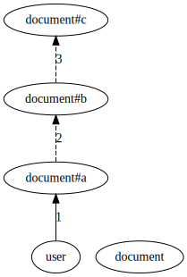

# ListObjects API implementation

At a high level, answering ListObjects queries involves a reverse expansion algorithm. Thinking of an authorization model as a directed graph and the tuples as the way of "moving" through that graph, we start the search from a specific object and explore (reverse expand) all the paths that can lead to the target object type and relation. During this expansion, we add to the final response all the concrete objects that we find that are of the target type. And if we discover usersets that don't match the target type and relation, we process those further.

## Example
Consider the following model:

```
type user

type document
   relations
     define a: [user]
     define b: a
     define c: b
```

<!--
digraph G {
    
  rankdir=BT

  user
  
  document
  
  user -> "document#a" [label="1"]
  
  "document#a" -> "document#b" [label="2"]
  
  "document#b" -> "document#c" [label="3"]
}
-->



And these tuples:

```go
document:budget#a@user:jon
```

The query is `ListObjects(user= user:jon, relation=document, type=c)` and the expected answer is `[document:budget]`.

```go
RecursiveReverseExpand(user:jon, document#c) ->
	
    edges(user:jon, document#c) -> [edge 1]

    // edge 1 (direct) starts at user and ends at document#a
    // find all tuples of form document:...#a@user:jon -> document:budget#a@user:jon
    RecursiveReverseExpand(document:budget#a, document#c) ->
	    
        edges(document:budget#a, document#c) -> [edge 2]

        // edge 2 (computed) starts at document#a and ends in document#b
        RecursiveReverseExpand(document:budget#b, document#c) ->

            edges(document:budget#b, document#c) -> [edge 3]

            // edge 3 (computed) starts at document#b and ends in document#c
            RecursiveReverseExpand(document:budget#c, document#c) ->
	
                // document:budget#c matches the target document#c
                add document:budget to the response
```
