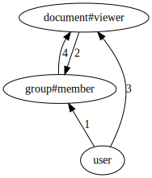

# ListObjects API implementation

At a high level, answering ListObjects queries involves a reverse expansion algorithm. Thinking of an authorization model as a directed graph and the tuples as the way of "moving" through that graph, we start the search from a specific object and explore (reverse expand) all the paths that can lead to the target object type and relation. During this expansion, we add to the final response all the concrete objects that we find that are of the target type. And if we discover usersets that don't match the target type and relation, we process those further.

## Example
Consider the following model:

```
type user

type group
   relations
     define member: [user, document#viewer] as self

type document
   relations
     define viewer: [user, group#member] as self
```

<!--

digraph G {
    
    rankdir=BT

  user -> "group#member" [label="1"]
  
  "document#viewer" -> "group#member" [label="2"]
  
  "user" -> "document#viewer" [label="3"]
  
  "group#member" -> "document#viewer" [label="4"]
}

-->



And these tuples:

```go
group:fga#member@user:jon
document:budget#viewer@user:bob
document:engineering#viewer@group:fga#member
group:finance#member@document:budget#viewer
```

The query is `ListObjects(user= user:jon, relation=viewer, type=document)` and the expected answer is `[document:engineering]`.

```go
RecursiveReverseExpand(user:jon, document#viewer) ->

    edges(user:jon, document#viewer) → [edge 1, edge 3]

    // edge 1
        // edge 1 (direct) starts at user and ends in group#member
        // find all tuples of form group:...#member@user:jon → group:fga#member@user:jon
        RecursiveReverseExpand(group:fga#member, document#viewer) →
        
            edges(group:fga#member, document#viewer) → [edge 4]
            
            // edge 4 (direct) starts at group#member and ends in document#viewer
            // find all tuples of form document:...#viewer@group:fga#member → document:engineering#viewer@group:fga#member
            RecursiveReverseExpand(document:engineering#viewer, document#viewer) →
            
                // document:engineering#viewer matches the target document#viewer
                add document:engineering to response
    
    // edge 3
        // edge 3 (direct) starts at user and  ends in document#viewer
        // find all tuples of form document:...#viewer@user:jon → []
        end
```

The query is `ListObjects(user= user:bob, relation=viewer, type=document)` and the expected answer is `[document:budget]`.

```go
RecursiveReverseExpand(user:bob, document#viewer) ->
	
    edges(user:bob, document#viewer) → [edge 1, edge 3]

    // edge 1
        // edge 1 (direct) starts at user and ends in group#member
        // find all tuples of form group:...#member@user:bob → []
        end

    // edge 3
        // edge 3 (direct) starts at user and ends in document#viewer
        // find all tuples of form document:...#viewer@user:bob → [document:budget#viewer]
        RecursiveReverseExpand(document:budget#viewer, document#viewer) →

            // document:budget#viewer matches the target document#viewer
            add document:budget to response
```