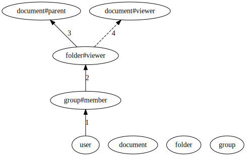

# ListObjects API implementation

At a high level, answering ListObjects queries involves a reverse expansion algorithm. Thinking of an authorization model as a directed graph and the tuples as the way of "moving" through that graph, we start the search from a specific object and explore (reverse expand) all the paths that can lead to the target object type and relation. During this expansion, we add to the final response all the concrete objects that we find that are of the target type. And if we discover usersets that don't match the target type and relation, we process those further.

## Example
Consider the following model:

```
type user

type folder
   relations
     define viewer: [group#member] as self

type group
   relations
     define member: [user] as self

type document
   relations
     define parent: [folder] as self
     define viewer as viewer from parent
```

<!--
digraph G {
    
  rankdir=BT

  user
  
  document
  
  folder
  
  group
  
    user -> "group#member" [label="1"]
  
  "group#member" -> "folder#viewer" [label="2"]
  
  "folder#viewer" -> "document#parent" [label="3"]
  
  "folder#viewer" -> "document#viewer" [label="4", style=dashed]
}

-->



And these tuples:

```go
group:fga#member@user:jon
folder:iam#viewer@group:fga#member
document:budget#parent@folder:iam
```

The query is `ListObjects(user= user:jon, relation=viewer, type=document)` and the expected answer is `[document:budget]`.

```go
RecursiveReverseExpand(user:jon, document#viewer) -> 
	
    edges(user:jon, document#viewer) -> [edge 1]

    // edge 1 (direct) starts at user and ends at group#member
    // find all tuples of form group:...#member@user:jon -> group:fga#member@user:jon
    RecursiveReverseExpand(group:fga#member, document#viewer) ->
	    
        edges(group:fga#member, document#viewer) -> [edge 2]

        // edge 2 (direct) starts at group#member and ends at folder#viewer
        // find all tuples of form folder:...#viewer@group:fga#member -> folder:iam#viewer@group:fga#member
        RecursiveReverseExpand(folder:iam#viewer, document#viewer) ->
	
            edges(folder:iam#viewer, document#viewer) -> [edge 4]

            // edge 4 (ttu) starts at folder#viewer and ends at document#viewer
            // and is associated to node document#parent
            // find all tuples of form document:...#parent@folder:iam -> document:budget#parent@folder:iam
            RecursiveReverseExpand(document:budget#viewer, document#viewer) ->

                // document:budget#viewer matches the target document#viewer
                add document:budget to response
```
