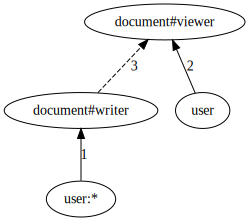

# ListObjects API implementation

At a high level, answering ListObjects queries involves a reverse expansion algorithm. Thinking of an authorization model as a directed graph and the tuples as the way of "moving" through that graph, we start the search from a specific object and explore (reverse expand) all the paths that can lead to the target object type and relation. During this expansion, we add to the final response all the concrete objects that we find that are of the target type. And if we discover usersets that don't match the target type and relation, we process those further.

## Example
Consider the following model:

```
type user
type document
    relations
        define writer: [user:*] as self
        define viewer: [user] as self or writer
```

<!--
digraph G {
    
    rankdir=BT
    
    "user:*" -> "document#writer" [label="1"]
    
    user -> "document#viewer" [label="2"]
    
    "document#writer" -> "document#viewer" [label="3", style=dashed]
}
-->



And these tuples:

```go
document:public#writer@user:*
document:private#viewer@user:jon
```

The query is `ListObjects(user= user:jon, relation=viewer, type=document)` and the expected answer is `[document:public, document:private]`.

```go
RecursiveReverseExpand(user:jon, document#viewer) → 
	
    edges(user:jon, document#viewer) → [edge 2]

    // there is an edge from user:* to document#viewer 
    RecursiveReverseExpand(user:*, document#viewer) → 

        edges(user:*, document#viewer) → [edge 1]

        // edge 1 (computed) starts at user:* and ends at document#writer
        // find all tuples of form document:...#writer@user:* → document:public#writer@user:*
        RecursiveReverseExpand(document:public#writer, document#viewer) →
            
            edges(document:public#writer, document#viewer) → [edge 3]

            // edge 3 (computed) starts at document#writer and ends at document#viewer
            RecursiveReverseExpand(document:public#viewer, document#viewer) →

                // document:public#viewer matches the target document#viewer
                add document:public to response

    // edge 2 (direct) starts at user and ends at document#viewer
    // find all tuples of form document:...#viewer@user:jon → document:private#viewer@user:jon
    RecursiveReverseExpand(document:private#viewer, document#viewer) →

        // document:private#viewer matches the target document#viewer
        add document:private to response
```
